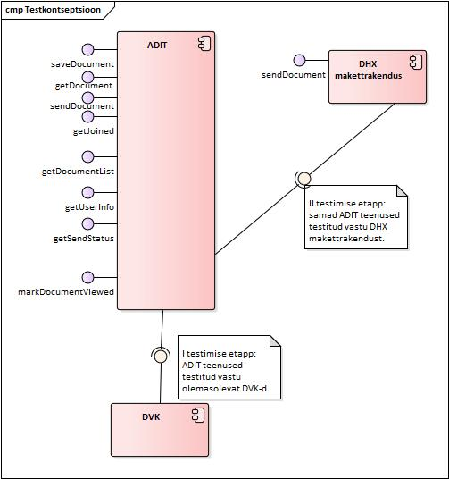

# Sisukord

- [Testimise strateegia](#test-strateegia)
- [Testilood](#tests)

  - [1. DHX protokolli teenuste testimine](#dhx-tests)
    - [1.1. Õige kapsli saatmine](#1.1)
    - [1.2. Vale kapsli saatmine](#1.2)
    - [1.3. Faili saatmine (fail ei ole kapsel)](#1.3)
    - [1.4. Duplikaadi kontroll](#1.4)
    - [1.5. Valele adressaadile saatmine](#1.5)
    - [1.6. Õige kapsli saatmine. Kapslis on määratud 'ARVED' kaust](#1.6)
    - [1.7. Õige kapsli saatmine. Erinevad saatjad, sama consignmentId](#1.7)
    - [1.8. Õige kapsli saatmine. Isik ei ole ADIT-is aktiveeritud](#1.8)
    - [1.9. Õige kapsli saatmine DHX adressaadile](#1.9)

  - [2. ADIT protokolli teenuste testimine](#adit-tests)
    - [2.1. Dokumendi loomine](#2.1)
    - [2.2. Dokumendi saatmine](#2.2)
    - [2.3. Dokumendi saatmine. 'ARVED' kaust](#2.3)
    - [2.4. Dokumendi saatmine vahendatavale](#2.4)
    - [2.5. Dokumendi saatmine alamsüsteemile](#2.5)
    - [2.6. Dokumendi saatmine mitmele adressaadile](#2.6)
    - [2.7. Dokumendi pärimine](#2.7)
    - [2.8. Dokumentide nimekiri](#2.8)
    - [2.9. Liitunud kasutajate nimekiri](#2.9)
    - [2.10. Kasutaja informatsioon](#2.10)
    - [2.11. Dokumendi staatus. Saadetud DHX-st](#2.11)
    - [2.12. Dokumendi vaadatuks märkimine. Saadetud DHX-st](#2.12)
    - [2.13. Dokumendi pärimine. Saadetud DHX-st](#2.13)
    - [2.14. Dokumentide nimekiri. Saadetud DHX-st](#2.14)
    
  - [3. ADIT makettrakenduse testid](#adit-makett-tests)
    - [3.1. Õige kapsli saatmine](#3.1)
    - [3.2. Duplikaadi kontroll](#3.2)
    - [3.3. ADIT süsteemist tulnud dokumendi vastuvõtmine](#3.3)

<a name="test-strateegia"></a>
# Testimise strateegia
DHX protokolli ja ADIT koostöö testimiseks valiti need ADITi teenused, mis on seotud dokumentide edastamisega:
  - saveDocument
  - sendDocument
  - getDocument
  - getJoined
  - getDocumentList
  - getUserInfo
  - getSendStatus
  - markDocumentViewed

  
  
Testimine on planeeritud läbi viia kahes etapis. Esimeses etapis testitakse ADIT dokumentide haldamisega seotud teenused vastu vana DVK-d. Seejärel realiseeritakse DHX protokolli võimekus ning testitakse samad teenused üle DHX-I vastu DHX makettrakendust, veendumaks, et kõik teenused töötavad samamoodi, nagu enne DHXi kasutuselevõttu.

<a name="tests"></a>
# Testilood

## **Tähistused:**

- Korrektselt kapseldatud fail - Vastavalt elektroonilise andmevahetuse metaandmete loendile 2.1  korrektselt kapseldatud fail.

ADIT testimiseks on vajalikud järgmised X-tee liikmed:

- DHS 1 - X-tee liige, kellel on olemas DHX alamsüsteem, kes on registreeritud DHX vahendajana ja pakub X-tee teenuseid representationList ja sendDocument vastavalt DHX protokollile. RepresentationList teenus peab tagastama vähemalt ühe vahendatava andmeid. Asutusel on registreeritud vähemalt üks DHX. prefiksiga (ntks DHX.subsystem) alamsüsteem, kuhu võib DHX protokolli järgi dokumente saata.

- ADIT - X-tee liige, teenuste omanik (pakkuja), ehk see liige, kellele dokumente saadetakse DHX-st ja kes pakub ADIT teenuseid DHS-le.

- CONSUMER - X-tee liige, kes suhtleb ADIT-iga (DHX ja ADIT teenustega)

- CONSUMER 2 - X-tee liige, kes suhtleb ADIT-iga (DHX ja ADIT teenustega). Erinev asutus või sama asutus, aga teise alamsüsteemiga (testi 1.7 täitmiseks)

Iga testiloo juures on kirjas, millised X-tee liikmed on vajalikud konkreetse testloo täitmiseks.

<a name="dhx-tests"></a>
## 1. DHX protokolli teenuste testimine


<a name="1.1"></a>
### 1.1. Õige kapsli saatmine

```
Saatev süsteem : CONSUMER
Kapsli adressaat : ADIT ja isik, kellele dokument on suunatud
X-tee adressaat : ADIT DHX alamsüsteem
Saadetis : korrektselt kapseldatud fail
```

#### **Verifitseerija toimimine (samm-sammuline)**:

- Testija saadab päringu DHX teenusesse sendDocument

  - Testija asendab sendDocument päringu XML-i kehas consignmentId elemendi sisu unikaalse id-ga (näiteks suvalise tekstiga).
  - SOAP päringu manuseks tuleb lisada korrektselt kapseldatud fail. Manuse ContentId-na tuleb panna 'doc'.

#### **Oodatav tulemus** :

- sendDocument päringu saatmisel vigu ei tekkinud ja päringu vastuses on olemas receiptId.

#### **Päringu näide:**

```xml
<soapenv:Envelope xmlns:soapenv="http://schemas.xmlsoap.org/soap/envelope/" xmlns:xro="http://x-road.eu/xsd/xroad.xsd" xmlns:iden="http://x-road.eu/xsd/identifiers" xmlns:prod="http://dhx.x-road.eu/producer">
    <soapenv:Header>
        <ns4:protocolVersion xmlns:ns2="http://dhx.x-road.eu/producer" xmlns:ns3="http://x-road.eu/xsd/identifiers" xmlns:ns4="http://x-road.eu/xsd/xroad.xsd" xmlns:ns5="http://www.riik.ee/schemas/deccontainer/vers_2_1/">4.0</ns4:protocolVersion>
        <ns4:id xmlns:ns2="http://dhx.x-road.eu/producer" xmlns:ns3="http://x-road.eu/xsd/identifiers" xmlns:ns4="http://x-road.eu/xsd/xroad.xsd" xmlns:ns5="http://www.riik.ee/schemas/deccontainer/vers_2_1/">64a3ddbd-1620-42c4-b2fe-60b854c2f32f
        </ns4:id>
        <ns4:client   ns3:objectType="SUBSYSTEM" xmlns:ns2="http://dhx.x-road.eu/producer" xmlns:ns3="http://x-road.eu/xsd/identifiers" xmlns:ns4="http://x-road.eu/xsd/xroad.xsd" xmlns:ns5="http://www.riik.ee/schemas/deccontainer/vers_2_1/">
            <ns3:xRoadInstance>ee-dev</ns3:xRoadInstance>
            <ns3:memberClass>COM</ns3:memberClass>
            <ns3:memberCode>12345678</ns3:memberCode>
            <ns3:subsystemCode>DHX</ns3:subsystemCode>
        </ns4:client>
        <ns4:service ns3:objectType="SERVICE" xmlns:ns2="http://dhx.x-road.eu/producer" xmlns:ns3="http://x-road.eu/xsd/identifiers" xmlns:ns4="http://x-road.eu/xsd/xroad.xsd" xmlns:ns5="http://www.riik.ee/schemas/deccontainer/vers_2_1/">
            <ns3:xRoadInstance>ee-dev</ns3:xRoadInstance>
            <ns3:memberClass>GOV</ns3:memberClass>
            <ns3:memberCode>70006317</ns3:memberCode>
            <ns3:subsystemCode>DHX.adit</ns3:subsystemCode>
            <ns3:serviceCode>sendDocument</ns3:serviceCode>
            <ns3:serviceVersion>v1</ns3:serviceVersion>
        </ns4:service>
        <rep:representedParty xmlns:rep="http://x-road.eu/xsd/representation.xsd"/><xro:userId/><xro:issue/>
    </soapenv:Header>
    <soapenv:Body>
        <prod:sendDocument>
            <!--Optional:-->
            <prod:DHXVersion>1.0</prod:DHXVersion>
            <prod:documentAttachment>cid:doc</prod:documentAttachment>
            <prod:consignmentId>4939808b-d393-4bb9-897e-1802b846d27d</prod:consignmentId>
        </prod:sendDocument>
    </soapenv:Body>
</soapenv:Envelope>
```

#### **Manus:**

```xml
<DecContainer xmlns="http://www.riik.ee/schemas/deccontainer/vers_2_1/">
    <Transport>
        <DecSender>
            <OrganisationCode>12345678</OrganisationCode>
            <PersonalIdCode>EE38806190294</PersonalIdCode>
        </DecSender>
        <DecRecipient>
            <OrganisationCode>70006317</OrganisationCode>
            <PersonalIdCode>EE37901130250</PersonalIdCode>
        </DecRecipient>
    </Transport>
    <RecordCreator>
        <Person>
            <Name>Lauri Tammemäe</Name>
            <GivenName>Lauri</GivenName>
            <Surname>Tammemäe</Surname>
            <PersonalIdCode>EE38806190294</PersonalIdCode>
            <Residency>EE</Residency>
        </Person>
        <ContactData>
            <Adit>true</Adit>
            <Phone>3726630276</Phone>
            <Email>lauri.tammemae@ria.ee</Email>
            <WebPage>www.hot.ee/lauri</WebPage>
            <MessagingAddress>skype: lauri.tammemae</MessagingAddress>
            <PostalAddress>
                <Country>Eesti</Country>
                <County>Harju maakond</County>
                <LocalGovernment>Tallinna linn</LocalGovernment>
                <AdministrativeUnit>Mustamäe linnaosa</AdministrativeUnit>
                <SmallPlace>Pääsukese KÜ</SmallPlace>
                <LandUnit></LandUnit>
                <Street>Mustamäe tee</Street>
                <HouseNumber>248</HouseNumber>
                <BuildingPartNumber>62</BuildingPartNumber>
                <PostalCode>11212</PostalCode>
            </PostalAddress>
        </ContactData>
    </RecordCreator>
    <RecordSenderToDec>
        <Person>
            <Name>Lauri Tammemäe</Name>
            <GivenName>Lauri</GivenName>
            <Surname>Tammemäe</Surname>
            <PersonalIdCode>EE38806190294</PersonalIdCode>
            <Residency>EE</Residency>
        </Person>
        <ContactData>
            <Adit>false</Adit>
            <Phone>3726630276</Phone>
            <Email>lauri.tammemae@ria.ee</Email>
            <WebPage>www.hot.ee/lauri</WebPage>
            <MessagingAddress>skype: lauri.tammemae</MessagingAddress>
            <PostalAddress>
                <Country>Eesti</Country>
                <County>Harju maakond</County>
                <LocalGovernment>Tallinna linn</LocalGovernment>
                <AdministrativeUnit>Mustamäe linnaosa</AdministrativeUnit>
                <SmallPlace>Pääsukese KÜ</SmallPlace>
                <LandUnit></LandUnit>
                <Street>Mustamäe tee</Street>
                <HouseNumber>248</HouseNumber>
                <BuildingPartNumber>62</BuildingPartNumber>
                <PostalCode>11212</PostalCode>
            </PostalAddress>
        </ContactData>
    </RecordSenderToDec>
    <Recipient>
        <Person>
            <Name>Lauri Tammemäe</Name>
            <GivenName>Lauri</GivenName>
            <Surname>Tammemäe</Surname>
            <PersonalIdCode>EE37901130250</PersonalIdCode>
            <Residency>EE</Residency>
        </Person>
    </Recipient>
    <RecordMetadata>
        <RecordGuid>25892e17-80f6-415f-9c65-7395632f0234</RecordGuid>
        <RecordType>Kiri</RecordType>
        <RecordOriginalIdentifier>213465</RecordOriginalIdentifier>
        <RecordDateRegistered>2012-11-11T19:18:03</RecordDateRegistered>
        <RecordTitle>Ettepanek</RecordTitle>
        <RecordLanguage>EE</RecordLanguage>
    </RecordMetadata>
    <Access>
        <AccessConditionsCode>Avalik</AccessConditionsCode>
    </Access>
    <File>
        <FileGuid>25892e17-80f6-415f-9c65-7395632f0001</FileGuid>
        <RecordMainComponent>0</RecordMainComponent>
        <FileName>Ettepanek.doc</FileName>
        <MimeType>application/msword</MimeType>
        <FileSize>211543</FileSize>
        <ZipBase64Content>H4sIACvlpU0AAwspqszMS1coyVcoTs1LUUjJT+YCALD0cp8TAAAA</ZipBase64Content>
    </File>
    <RecordTypeSpecificMetadata/>
    <DecMetadata>
        <DecId>410125</DecId>
        <DecFolder>/</DecFolder>
        <DecReceiptDate>2012-11-11T19:20:42</DecReceiptDate>
    </DecMetadata>
</DecContainer>
```

<a name="1.2"></a>

### 1.2. Vale kapsli saatmine

```
Saatev süsteem : CONSUMER
Kapsli adressaat : ADIT ja isik, kellele dokument on suunatud
X-tee adressaat : ADIT DHX alamsüsteem
Saadetis : kapsli fail, mis ei vasta Elektroonilise andmevahetuse metaandmete loendile 2.1 (nt puudu kohustuslik väli), aga on XML-vormingus fail õige XML-vorminguga.
```

#### **Verifitseerija toimimine (samm-sammuline):**

- Testija saadab päringu DHX teenusesse sendDocument

  - Testija asendab sendDocument päringu XML-i kehas consignmentId elemendi sisu unikaalse id-ga (näiteks suvalise tekstiga).
  - SOAP päringu manuseks tuleb lisada kapsli fail, mis ei vasta Elektroonilise andmevahetuse metaandmete loendile 2.1 (nt puudu kohustuslik väli), aga on XML-fail õige XML-vorminguga. Manuse ContentId-na tuleb panna 'doc'.

#### **Oodatav tulemus** :

- sendDocument päringu vastuses on DHX.Validation koodiga fault.

#### **Päringu näide:**

```xml
<soapenv:Envelope xmlns:soapenv="http://schemas.xmlsoap.org/soap/envelope/" xmlns:xro="http://x-road.eu/xsd/xroad.xsd" xmlns:iden="http://x-road.eu/xsd/identifiers" xmlns:prod="http://dhx.x-road.eu/producer">
    <soapenv:Header>
        <ns4:protocolVersion xmlns:ns2="http://dhx.x-road.eu/producer" xmlns:ns3="http://x-road.eu/xsd/identifiers" xmlns:ns4="http://x-road.eu/xsd/xroad.xsd" xmlns:ns5="http://www.riik.ee/schemas/deccontainer/vers_2_1/">4.0</ns4:protocolVersion>
        <ns4:id xmlns:ns2="http://dhx.x-road.eu/producer" xmlns:ns3="http://x-road.eu/xsd/identifiers" xmlns:ns4="http://x-road.eu/xsd/xroad.xsd" xmlns:ns5="http://www.riik.ee/schemas/deccontainer/vers_2_1/">64a3ddbd-1620-42c4-b2fe-60b854c2f32f
        </ns4:id>
        <ns4:client   ns3:objectType="SUBSYSTEM" xmlns:ns2="http://dhx.x-road.eu/producer" xmlns:ns3="http://x-road.eu/xsd/identifiers" xmlns:ns4="http://x-road.eu/xsd/xroad.xsd" xmlns:ns5="http://www.riik.ee/schemas/deccontainer/vers_2_1/">
            <ns3:xRoadInstance>ee-dev</ns3:xRoadInstance>
            <ns3:memberClass>COM</ns3:memberClass>
            <ns3:memberCode>12345678</ns3:memberCode>
            <ns3:subsystemCode>DHX</ns3:subsystemCode>
        </ns4:client>
        <ns4:service ns3:objectType="SERVICE" xmlns:ns2="http://dhx.x-road.eu/producer" xmlns:ns3="http://x-road.eu/xsd/identifiers" xmlns:ns4="http://x-road.eu/xsd/xroad.xsd" xmlns:ns5="http://www.riik.ee/schemas/deccontainer/vers_2_1/">
            <ns3:xRoadInstance>ee-dev</ns3:xRoadInstance>
            <ns3:memberClass>GOV</ns3:memberClass>
            <ns3:memberCode>70006317</ns3:memberCode>
            <ns3:subsystemCode>DHX.adit</ns3:subsystemCode>
            <ns3:serviceCode>sendDocument</ns3:serviceCode>
            <ns3:serviceVersion>v1</ns3:serviceVersion>
        </ns4:service>
        <rep:representedParty xmlns:rep="http://x-road.eu/xsd/representation.xsd"/><xro:userId/><xro:issue/>
    </soapenv:Header>
    <soapenv:Body>
        <prod:sendDocument>
            <!--Optional:-->
            <prod:DHXVersion>1.0</prod:DHXVersion>
            <prod:documentAttachment>cid:doc</prod:documentAttachment>
            <prod:consignmentId>4939808b-d393-4bb9-897e-1802b846d27d</prod:consignmentId>
        </prod:sendDocument>
    </soapenv:Body>
</soapenv:Envelope>
```

#### **Manus:**

```xml
<DecContainer xmlns="http://www.riik.ee/schemas/deccontainer/vers_2_1/">
  <RecordCreator>
    <Person>
      <Name>Lauri Tammemäe</Name>
      <GivenName>Lauri</GivenName>
      <Surname>Tammemäe</Surname>
      <PersonalIdCode>EE38806190294</PersonalIdCode>
      <Residency>EE</Residency>
    </Person>
    <ContactData>
      <Adit>true</Adit>
      <Phone>3726630276</Phone>
      <Email>lauri.tammemae@ria.ee</Email>
      <WebPage>www.hot.ee/lauri</WebPage>
      <MessagingAddress>skype: lauri.tammemae</MessagingAddress>
      <PostalAddress>
        <Country>Eesti</Country>
        <County>Harju maakond</County>
        <LocalGovernment>Tallinna linn</LocalGovernment>
        <AdministrativeUnit>Mustamäe linnaosa</AdministrativeUnit>
        <SmallPlace>Pääsukese KÜ</SmallPlace>
        <LandUnit></LandUnit>
        <Street>Mustamäe tee</Street>
        <HouseNumber>248</HouseNumber>
        <BuildingPartNumber>62</BuildingPartNumber>
        <PostalCode>11212</PostalCode>
      </PostalAddress>
    </ContactData>
  </RecordCreator>
  <RecordSenderToDec>
    <Person>
      <Name>Lauri Tammemäe</Name>
      <GivenName>Lauri</GivenName>
      <Surname>Tammemäe</Surname>
      <PersonalIdCode>EE38806190294</PersonalIdCode>
      <Residency>EE</Residency>
    </Person>
    <ContactData>
      <Adit>false</Adit>
      <Phone>3726630276</Phone>
      <Email>lauri.tammemae@ria.ee</Email>
      <WebPage>www.hot.ee/lauri</WebPage>
      <MessagingAddress>skype: lauri.tammemae</MessagingAddress>
      <PostalAddress>
        <Country>Eesti</Country>
        <County>Harju maakond</County>
        <LocalGovernment>Tallinna linn</LocalGovernment>
        <AdministrativeUnit>Mustamäe linnaosa</AdministrativeUnit>
        <SmallPlace>Pääsukese KÜ</SmallPlace>
        <LandUnit></LandUnit>
        <Street>Mustamäe tee</Street>
        <HouseNumber>248</HouseNumber>
        <BuildingPartNumber>62</BuildingPartNumber>
        <PostalCode>11212</PostalCode>
      </PostalAddress>
    </ContactData>
  </RecordSenderToDec>
  <Recipient>
    <Organisation>
      <Name>Riigi Infosüsteemi Amet</Name>
      <OrganisationCode>70006317</OrganisationCode>
      <Residency>EE</Residency>
    </Organisation>
  </Recipient>
  <RecordMetadata>
    <RecordGuid>25892e17-80f6-415f-9c65-7395632f0234</RecordGuid>
    <RecordType>Kiri</RecordType>
    <RecordOriginalIdentifier>213465</RecordOriginalIdentifier>
    <RecordDateRegistered>2012-11-11T19:18:03</RecordDateRegistered>
    <RecordTitle>Ettepanek</RecordTitle>
    <RecordLanguage>EE</RecordLanguage>
  </RecordMetadata>
  <Access>
    <AccessConditionsCode>Avalik</AccessConditionsCode>
  </Access>
  <File>
    <FileGuid>25892e17-80f6-415f-9c65-7395632f0001</FileGuid>
    <RecordMainComponent>0</RecordMainComponent>
    <FileName>Ettepanek.doc</FileName>
    <MimeType>application/msword</MimeType>
    <FileSize>211543</FileSize>
    <ZipBase64Content>H4sIACvlpU0AAwspqszMS1coyVcoTs1LUUjJT+YCALD0cp8TAAAA</ZipBase64Content>
  </File>
  <RecordTypeSpecificMetadata />
  <DecMetadata>
    <DecId>410125</DecId>
    <DecFolder>/</DecFolder>
    <DecReceiptDate>2012-11-11T19:20:42</DecReceiptDate>
  </DecMetadata>
</DecContainer>
```

<a name="1.3"></a>
### 1.3. Faili saatmine (fail ei ole kapsel)

```
Saatev süsteem : CONSUMER
Kapsli adressaat : ADIT ja isik, kellele dokument on suunatud
X-tee adressaat : ADIT DHX alamsüsteem
Saadetis : fail, mis ei ole XML-vormingus või on XML vale vorminguga.
```

#### **Verifitseerija toimimine (samm-sammuline):**

- Testija saadab päringu DHX teenusesse sendDocument

  - Testija asendab sendDocument päringu XML-i kehas consignmentId elemendi sisu unikaalse id-ga(näiteks suvalise tekstiga).
  - SOAP päringu manusena tuleb panna fail, mis ei ole XML-vormingus või on XML vale vorminguga. Manuse ContentId-na tuleb panna 'doc'.

#### **Oodatav tulemus** :

- sendDocument päringu vastuses on DHX.Validation koodiga fault.

#### **Päringu näide:**

```xml
<soapenv:Envelope xmlns:soapenv="http://schemas.xmlsoap.org/soap/envelope/" xmlns:xro="http://x-road.eu/xsd/xroad.xsd" xmlns:iden="http://x-road.eu/xsd/identifiers" xmlns:prod="http://dhx.x-road.eu/producer">
    <soapenv:Header>
        <ns4:protocolVersion xmlns:ns2="http://dhx.x-road.eu/producer" xmlns:ns3="http://x-road.eu/xsd/identifiers" xmlns:ns4="http://x-road.eu/xsd/xroad.xsd" xmlns:ns5="http://www.riik.ee/schemas/deccontainer/vers_2_1/">4.0</ns4:protocolVersion>
        <ns4:id xmlns:ns2="http://dhx.x-road.eu/producer" xmlns:ns3="http://x-road.eu/xsd/identifiers" xmlns:ns4="http://x-road.eu/xsd/xroad.xsd" xmlns:ns5="http://www.riik.ee/schemas/deccontainer/vers_2_1/">64a3ddbd-1620-42c4-b2fe-60b854c2f32f
        </ns4:id>
        <ns4:client   ns3:objectType="SUBSYSTEM" xmlns:ns2="http://dhx.x-road.eu/producer" xmlns:ns3="http://x-road.eu/xsd/identifiers" xmlns:ns4="http://x-road.eu/xsd/xroad.xsd" xmlns:ns5="http://www.riik.ee/schemas/deccontainer/vers_2_1/">
            <ns3:xRoadInstance>ee-dev</ns3:xRoadInstance>
            <ns3:memberClass>COM</ns3:memberClass>
            <ns3:memberCode>12345678</ns3:memberCode>
            <ns3:subsystemCode>DHX</ns3:subsystemCode>
        </ns4:client>
        <ns4:service ns3:objectType="SERVICE" xmlns:ns2="http://dhx.x-road.eu/producer" xmlns:ns3="http://x-road.eu/xsd/identifiers" xmlns:ns4="http://x-road.eu/xsd/xroad.xsd" xmlns:ns5="http://www.riik.ee/schemas/deccontainer/vers_2_1/">
            <ns3:xRoadInstance>ee-dev</ns3:xRoadInstance>
            <ns3:memberClass>GOV</ns3:memberClass>
            <ns3:memberCode>70006317</ns3:memberCode>
            <ns3:subsystemCode>DHX.adit</ns3:subsystemCode>
            <ns3:serviceCode>sendDocument</ns3:serviceCode>
            <ns3:serviceVersion>v1</ns3:serviceVersion>
        </ns4:service>
        <rep:representedParty xmlns:rep="http://x-road.eu/xsd/representation.xsd"/><xro:userId/><xro:issue/>
    </soapenv:Header>
    <soapenv:Body>
        <prod:sendDocument>
            <!--Optional:-->
            <prod:DHXVersion>1.0</prod:DHXVersion>
            <prod:documentAttachment>cid:doc</prod:documentAttachment>
            <prod:consignmentId>4939808b-d393-4bb9-897e-1802b846d27d</prod:consignmentId>
        </prod:sendDocument>
    </soapenv:Body>
</soapenv:Envelope>
```

#### **Manus:**

```xml
Test fail.
```

<a name="1.4"></a>
### 1.4. Duplikaadi kontroll

```
Saatev süsteem : CONSUMER
Kapsli adressaat : ADIT ja isik, kellele dokument on suunatud
X-tee adressaat : ADIT DHX alamsüsteem
Saadetis : korrektselt kapseldatud fail
```

#### **Verifitseerija toimimine (samm-sammuline):**

- Testija saadab päringu DHX teenusesse sendDocument

  - Testija asendab sendDocument päringu XML-i kehas consignmentId elemendi sisu väärtusega, millisega on eelnevalt dokument juba saadetud.
  - SOAP päringu manuseks tuleb lisada korrektselt kapseldatud fail. Manuse ContentId-na tuleb panna 'doc'.

#### **Oodatav tulemus** :

- sendDocument päringu vastuses on DHX.Duplicate koodiga fault.

#### **Päringu näide:**

```xml
<soapenv:Envelope xmlns:soapenv="http://schemas.xmlsoap.org/soap/envelope/" xmlns:xro="http://x-road.eu/xsd/xroad.xsd" xmlns:iden="http://x-road.eu/xsd/identifiers" xmlns:prod="http://dhx.x-road.eu/producer">
    <soapenv:Header>
        <ns4:protocolVersion xmlns:ns2="http://dhx.x-road.eu/producer" xmlns:ns3="http://x-road.eu/xsd/identifiers" xmlns:ns4="http://x-road.eu/xsd/xroad.xsd" xmlns:ns5="http://www.riik.ee/schemas/deccontainer/vers_2_1/">4.0</ns4:protocolVersion>
        <ns4:id xmlns:ns2="http://dhx.x-road.eu/producer" xmlns:ns3="http://x-road.eu/xsd/identifiers" xmlns:ns4="http://x-road.eu/xsd/xroad.xsd" xmlns:ns5="http://www.riik.ee/schemas/deccontainer/vers_2_1/">64a3ddbd-1620-42c4-b2fe-60b854c2f32f
        </ns4:id>
        <ns4:client   ns3:objectType="SUBSYSTEM" xmlns:ns2="http://dhx.x-road.eu/producer" xmlns:ns3="http://x-road.eu/xsd/identifiers" xmlns:ns4="http://x-road.eu/xsd/xroad.xsd" xmlns:ns5="http://www.riik.ee/schemas/deccontainer/vers_2_1/">
            <ns3:xRoadInstance>ee-dev</ns3:xRoadInstance>
            <ns3:memberClass>COM</ns3:memberClass>
            <ns3:memberCode>12345678</ns3:memberCode>
            <ns3:subsystemCode>DHX</ns3:subsystemCode>
        </ns4:client>
        <ns4:service ns3:objectType="SERVICE" xmlns:ns2="http://dhx.x-road.eu/producer" xmlns:ns3="http://x-road.eu/xsd/identifiers" xmlns:ns4="http://x-road.eu/xsd/xroad.xsd" xmlns:ns5="http://www.riik.ee/schemas/deccontainer/vers_2_1/">
            <ns3:xRoadInstance>ee-dev</ns3:xRoadInstance>
            <ns3:memberClass>GOV</ns3:memberClass>
            <ns3:memberCode>70006317</ns3:memberCode>
            <ns3:subsystemCode>DHX.adit</ns3:subsystemCode>
            <ns3:serviceCode>sendDocument</ns3:serviceCode>
            <ns3:serviceVersion>v1</ns3:serviceVersion>
        </ns4:service>
        <rep:representedParty xmlns:rep="http://x-road.eu/xsd/representation.xsd"/><xro:userId/><xro:issue/>
    </soapenv:Header>
    <soapenv:Body>
        <prod:sendDocument>
            <!--Optional:-->
            <prod:DHXVersion>1.0</prod:DHXVersion>
            <prod:documentAttachment>cid:doc</prod:documentAttachment>
            <prod:consignmentId>4939808b-d393-4bb9-897e-1802b846d27d</prod:consignmentId>
        </prod:sendDocument>
    </soapenv:Body>
</soapenv:Envelope>
```

#### **Manus:**

```xml
<DecContainer xmlns="http://www.riik.ee/schemas/deccontainer/vers_2_1/">
  <Transport>
    <DecSender>
        <OrganisationCode>12345678</OrganisationCode>
        <PersonalIdCode>EE38806190294</PersonalIdCode>
    </DecSender>
    <DecRecipient>
        <OrganisationCode>70006317</OrganisationCode>
    </DecRecipient>
  </Transport>
  <RecordCreator>
    <Person>
      <Name>Lauri Tammemäe</Name>
      <GivenName>Lauri</GivenName>
      <Surname>Tammemäe</Surname>
      <PersonalIdCode>EE38806190294</PersonalIdCode>
      <Residency>EE</Residency>
    </Person>
    <ContactData>
      <Adit>true</Adit>
      <Phone>3726630276</Phone>
      <Email>lauri.tammemae@ria.ee</Email>
      <WebPage>www.hot.ee/lauri</WebPage>
      <MessagingAddress>skype: lauri.tammemae</MessagingAddress>
      <PostalAddress>
        <Country>Eesti</Country>
        <County>Harju maakond</County>
        <LocalGovernment>Tallinna linn</LocalGovernment>
        <AdministrativeUnit>Mustamäe linnaosa</AdministrativeUnit>
        <SmallPlace>Pääsukese KÜ</SmallPlace>
        <LandUnit></LandUnit>
        <Street>Mustamäe tee</Street>
        <HouseNumber>248</HouseNumber>
        <BuildingPartNumber>62</BuildingPartNumber>
        <PostalCode>11212</PostalCode>
      </PostalAddress>
    </ContactData>
  </RecordCreator>
  <RecordSenderToDec>
    <Person>
      <Name>Lauri Tammemäe</Name>
      <GivenName>Lauri</GivenName>
      <Surname>Tammemäe</Surname>
      <PersonalIdCode>EE38806190294</PersonalIdCode>
      <Residency>EE</Residency>
    </Person>
    <ContactData>
      <Adit>false</Adit>
      <Phone>3726630276</Phone>
      <Email>lauri.tammemae@ria.ee</Email>
      <WebPage>www.hot.ee/lauri</WebPage>
      <MessagingAddress>skype: lauri.tammemae</MessagingAddress>
      <PostalAddress>
        <Country>Eesti</Country>
        <County>Harju maakond</County>
        <LocalGovernment>Tallinna linn</LocalGovernment>
        <AdministrativeUnit>Mustamäe linnaosa</AdministrativeUnit>
        <SmallPlace>Pääsukese KÜ</SmallPlace>
        <LandUnit></LandUnit>
        <Street>Mustamäe tee</Street>
        <HouseNumber>248</HouseNumber>
        <BuildingPartNumber>62</BuildingPartNumber>
        <PostalCode>11212</PostalCode>
      </PostalAddress>
    </ContactData>
  </RecordSenderToDec>
  <Recipient>
    <Organisation>
      <Name>Riigi Infosüsteemi Amet</Name>
      <OrganisationCode>70006317</OrganisationCode>
      <Residency>EE</Residency>
    </Organisation>
  </Recipient>
  <RecordMetadata>
    <RecordGuid>25892e17-80f6-415f-9c65-7395632f0234</RecordGuid>
    <RecordType>Kiri</RecordType>
    <RecordOriginalIdentifier>213465</RecordOriginalIdentifier>
    <RecordDateRegistered>2012-11-11T19:18:03</RecordDateRegistered>
    <RecordTitle>Ettepanek</RecordTitle>
    <RecordLanguage>EE</RecordLanguage>
  </RecordMetadata>
  <Access>
    <AccessConditionsCode>Avalik</AccessConditionsCode>
  </Access>
  <File>
    <FileGuid>25892e17-80f6-415f-9c65-7395632f0001</FileGuid>
    <RecordMainComponent>0</RecordMainComponent>
    <FileName>Ettepanek.doc</FileName>
    <MimeType>application/msword</MimeType>
    <FileSize>211543</FileSize>
    <ZipBase64Content>H4sIACvlpU0AAwspqszMS1coyVcoTs1LUUjJT+YCALD0cp8TAAAA</ZipBase64Content>
  </File>
  <RecordTypeSpecificMetadata />
  <DecMetadata>
    <DecId>410125</DecId>
    <DecFolder>/</DecFolder>
    <DecReceiptDate>2012-11-11T19:20:42</DecReceiptDate>
  </DecMetadata>
</DecContainer>
```

<a name="1.5"></a>
### 1.5. Valele adressaadile saatmine

```
Saatev süsteem : CONSUMER
X-tee adressaat : ADIT DHX alamsüsteem
Kapsli adressaat : puudu oleva registrikoodiga adressaat
Saadetis : korrektselt kapseldatud fail
```

#### **Verifitseerija toimimine (samm-sammuline):**

- Testija saadab päringu DHX teenusesse sendDocument

  - Testija asendab sendDocument päringu XML-i kehas consignmentId elemendi sisu unikaalse id-ga (näiteks suvalise tekstiga).
  - SOAP päringu manusena tuleb lisada korrektselt kapseldatud fail. Manuse ContentId-na tuleb panna 'doc'.

#### **Oodatav tulemus** :

- sendDocument päringu vastuses on DHX.InvalidAddressee koodiga fault.

#### **Päringu näide:**

```xml
<soapenv:Envelope xmlns:soapenv="http://schemas.xmlsoap.org/soap/envelope/" xmlns:xro="http://x-road.eu/xsd/xroad.xsd" xmlns:iden="http://x-road.eu/xsd/identifiers" xmlns:prod="http://dhx.x-road.eu/producer">
    <soapenv:Header>
        <ns4:protocolVersion xmlns:ns2="http://dhx.x-road.eu/producer" xmlns:ns3="http://x-road.eu/xsd/identifiers" xmlns:ns4="http://x-road.eu/xsd/xroad.xsd" xmlns:ns5="http://www.riik.ee/schemas/deccontainer/vers_2_1/">4.0</ns4:protocolVersion>
        <ns4:id xmlns:ns2="http://dhx.x-road.eu/producer" xmlns:ns3="http://x-road.eu/xsd/identifiers" xmlns:ns4="http://x-road.eu/xsd/xroad.xsd" xmlns:ns5="http://www.riik.ee/schemas/deccontainer/vers_2_1/">64a3ddbd-1620-42c4-b2fe-60b854c2f32f
        </ns4:id>
        <ns4:client   ns3:objectType="SUBSYSTEM" xmlns:ns2="http://dhx.x-road.eu/producer" xmlns:ns3="http://x-road.eu/xsd/identifiers" xmlns:ns4="http://x-road.eu/xsd/xroad.xsd" xmlns:ns5="http://www.riik.ee/schemas/deccontainer/vers_2_1/">
            <ns3:xRoadInstance>ee-dev</ns3:xRoadInstance>
            <ns3:memberClass>COM</ns3:memberClass>
            <ns3:memberCode>12345678</ns3:memberCode>
            <ns3:subsystemCode>DHX</ns3:subsystemCode>
        </ns4:client>
        <ns4:service ns3:objectType="SERVICE" xmlns:ns2="http://dhx.x-road.eu/producer" xmlns:ns3="http://x-road.eu/xsd/identifiers" xmlns:ns4="http://x-road.eu/xsd/xroad.xsd" xmlns:ns5="http://www.riik.ee/schemas/deccontainer/vers_2_1/">
            <ns3:xRoadInstance>ee-dev</ns3:xRoadInstance>
            <ns3:memberClass>GOV</ns3:memberClass>
            <ns3:memberCode>70006317</ns3:memberCode>
            <ns3:subsystemCode>DHX.adit</ns3:subsystemCode>
            <ns3:serviceCode>sendDocument</ns3:serviceCode>
            <ns3:serviceVersion>v1</ns3:serviceVersion>
        </ns4:service>
        <rep:representedParty xmlns:rep="http://x-road.eu/xsd/representation.xsd"/><xro:userId/><xro:issue/>
    </soapenv:Header>
    <soapenv:Body>
        <prod:sendDocument>
            <!--Optional:-->
            <prod:DHXVersion>1.0</prod:DHXVersion>
            <prod:documentAttachment>cid:doc</prod:documentAttachment>
            <prod:consignmentId>4939808b-d393-4bb9-897e-1802b846d27d</prod:consignmentId>
        </prod:sendDocument>
    </soapenv:Body>
</soapenv:Envelope>
```

#### **Manus:**

```xml
<DecContainer xmlns="http://www.riik.ee/schemas/deccontainer/vers_2_1/">
  <Transport>
    <DecSender>
        <OrganisationCode>12345678</OrganisationCode>
        <PersonalIdCode>EE38806190294</PersonalIdCode>
    </DecSender>
    <DecRecipient>
        <OrganisationCode></OrganisationCode>
    </DecRecipient>
  </Transport>
  <RecordCreator>
    <Person>
      <Name>Lauri Tammemäe</Name>
      <GivenName>Lauri</GivenName>
      <Surname>Tammemäe</Surname>
      <PersonalIdCode>EE38806190294</PersonalIdCode>
      <Residency>EE</Residency>
    </Person>
    <ContactData>
      <Adit>true</Adit>
      <Phone>3726630276</Phone>
      <Email>lauri.tammemae@ria.ee</Email>
      <WebPage>www.hot.ee/lauri</WebPage>
      <MessagingAddress>skype: lauri.tammemae</MessagingAddress>
      <PostalAddress>
        <Country>Eesti</Country>
        <County>Harju maakond</County>
        <LocalGovernment>Tallinna linn</LocalGovernment>
        <AdministrativeUnit>Mustamäe linnaosa</AdministrativeUnit>
        <SmallPlace>Pääsukese KÜ</SmallPlace>
        <LandUnit></LandUnit>
        <Street>Mustamäe tee</Street>
        <HouseNumber>248</HouseNumber>
        <BuildingPartNumber>62</BuildingPartNumber>
        <PostalCode>11212</PostalCode>
      </PostalAddress>
    </ContactData>
  </RecordCreator>
  <RecordSenderToDec>
    <Person>
      <Name>Lauri Tammemäe</Name>
      <GivenName>Lauri</GivenName>
      <Surname>Tammemäe</Surname>
      <PersonalIdCode>EE38806190294</PersonalIdCode>
      <Residency>EE</Residency>
    </Person>
    <ContactData>
      <Adit>false</Adit>
      <Phone>3726630276</Phone>
      <Email>lauri.tammemae@ria.ee</Email>
      <WebPage>www.hot.ee/lauri</WebPage>
      <MessagingAddress>skype: lauri.tammemae</MessagingAddress>
      <PostalAddress>
        <Country>Eesti</Country>
        <County>Harju maakond</County>
        <LocalGovernment>Tallinna linn</LocalGovernment>
        <AdministrativeUnit>Mustamäe linnaosa</AdministrativeUnit>
        <SmallPlace>Pääsukese KÜ</SmallPlace>
        <LandUnit></LandUnit>
        <Street>Mustamäe tee</Street>
        <HouseNumber>248</HouseNumber>
        <BuildingPartNumber>62</BuildingPartNumber>
        <PostalCode>11212</PostalCode>
      </PostalAddress>
    </ContactData>
  </RecordSenderToDec>
  <Recipient>
    <Organisation>
      <Name>Riigi Infosüsteemi Amet</Name>
      <OrganisationCode>70006317</OrganisationCode>
      <Residency>EE</Residency>
    </Organisation>
  </Recipient>
  <RecordMetadata>
    <RecordGuid>25892e17-80f6-415f-9c65-7395632f0234</RecordGuid>
    <RecordType>Kiri</RecordType>
    <RecordOriginalIdentifier>213465</RecordOriginalIdentifier>
    <RecordDateRegistered>2012-11-11T19:18:03</RecordDateRegistered>
    <RecordTitle>Ettepanek</RecordTitle>
    <RecordLanguage>EE</RecordLanguage>
  </RecordMetadata>
  <Access>
    <AccessConditionsCode>Avalik</AccessConditionsCode>
  </Access>
  <File>
    <FileGuid>25892e17-80f6-415f-9c65-7395632f0001</FileGuid>
    <RecordMainComponent>0</RecordMainComponent>
    <FileName>Ettepanek.doc</FileName>
    <MimeType>application/msword</MimeType>
    <FileSize>211543</FileSize>
    <ZipBase64Content>H4sIACvlpU0AAwspqszMS1coyVcoTs1LUUjJT+YCALD0cp8TAAAA</ZipBase64Content>
  </File>
  <RecordTypeSpecificMetadata />
  <DecMetadata>
    <DecId>410125</DecId>
    <DecFolder>/</DecFolder>
    <DecReceiptDate>2012-11-11T19:20:42</DecReceiptDate>
  </DecMetadata>
</DecContainer>
```

<a name="1.6"></a>
### 1.6. Õige kapsli saatmine. Kapslis on määratud 'ARVED' kaust.

```
Saatev süsteem : CONSUMER
Kapsli adressaat : ADIT ja isik, kellele dokument on suunatud
X-tee adressaat : ADIT DHX alamsüsteem
Saadetis : korrektselt kapseldatud fail
```

#### **Verifitseerija toimimine (samm-sammuline):**

- Testija saadab päringu DHX teenusesse sendDocument

  - Testija asendab sendDocument päringu XML-i kehas consignmentId elemendi sisu unikaalse id-ga(näiteks suvalise tekstiga).
  - SOAP päringu manuseks tuleb lisada korrektselt kapseldatud fail. Manuse ContentId-na tuleb panna 'doc'.
  - Testija määrab kapslis DecFolder ning väärtuseks on ARVED

#### **Oodatav tulemus** :

- sendDocument päringu saatmisel vigu ei tekkinud ja päringu vastuses on olemas receiptId.

#### **Päringu näide:**

```xml
<soapenv:Envelope xmlns:soapenv="http://schemas.xmlsoap.org/soap/envelope/" xmlns:xro="http://x-road.eu/xsd/xroad.xsd" xmlns:iden="http://x-road.eu/xsd/identifiers" xmlns:prod="http://dhx.x-road.eu/producer">
    <soapenv:Header>
        <ns4:protocolVersion xmlns:ns2="http://dhx.x-road.eu/producer" xmlns:ns3="http://x-road.eu/xsd/identifiers" xmlns:ns4="http://x-road.eu/xsd/xroad.xsd" xmlns:ns5="http://www.riik.ee/schemas/deccontainer/vers_2_1/">4.0</ns4:protocolVersion>
        <ns4:id xmlns:ns2="http://dhx.x-road.eu/producer" xmlns:ns3="http://x-road.eu/xsd/identifiers" xmlns:ns4="http://x-road.eu/xsd/xroad.xsd" xmlns:ns5="http://www.riik.ee/schemas/deccontainer/vers_2_1/">64a3ddbd-1620-42c4-b2fe-60b854c2f32f
        </ns4:id>
        <ns4:client   ns3:objectType="SUBSYSTEM" xmlns:ns2="http://dhx.x-road.eu/producer" xmlns:ns3="http://x-road.eu/xsd/identifiers" xmlns:ns4="http://x-road.eu/xsd/xroad.xsd" xmlns:ns5="http://www.riik.ee/schemas/deccontainer/vers_2_1/">
            <ns3:xRoadInstance>ee-dev</ns3:xRoadInstance>
            <ns3:memberClass>COM</ns3:memberClass>
            <ns3:memberCode>12345678</ns3:memberCode>
            <ns3:subsystemCode>DHX</ns3:subsystemCode>
        </ns4:client>
        <ns4:service ns3:objectType="SERVICE" xmlns:ns2="http://dhx.x-road.eu/producer" xmlns:ns3="http://x-road.eu/xsd/identifiers" xmlns:ns4="http://x-road.eu/xsd/xroad.xsd" xmlns:ns5="http://www.riik.ee/schemas/deccontainer/vers_2_1/">
            <ns3:xRoadInstance>ee-dev</ns3:xRoadInstance>
            <ns3:memberClass>GOV</ns3:memberClass>
            <ns3:memberCode>70006317</ns3:memberCode>
            <ns3:subsystemCode>DHX.adit</ns3:subsystemCode>
            <ns3:serviceCode>sendDocument</ns3:serviceCode>
            <ns3:serviceVersion>v1</ns3:serviceVersion>
        </ns4:service>
        <rep:representedParty xmlns:rep="http://x-road.eu/xsd/representation.xsd"/><xro:userId/><xro:issue/>
    </soapenv:Header>
    <soapenv:Body>
        <prod:sendDocument>
            <!--Optional:-->
            <prod:DHXVersion>1.0</prod:DHXVersion>
            <prod:documentAttachment>cid:doc</prod:documentAttachment>
            <prod:consignmentId>4939808b-d393-4bb9-897e-1802b846d27d</prod:consignmentId>
        </prod:sendDocument>
    </soapenv:Body>
</soapenv:Envelope>
```

#### **Manus:**

```xml
<DecContainer xmlns="http://www.riik.ee/schemas/deccontainer/vers_2_1/">
    <Transport>
        <DecSender>
            <OrganisationCode>12345678</OrganisationCode>
            <PersonalIdCode>EE38806190294</PersonalIdCode>
        </DecSender>
        <DecRecipient>
            <OrganisationCode>70006317</OrganisationCode>
            <PersonalIdCode>EE37901130250</PersonalIdCode>
        </DecRecipient>
    </Transport>
    <RecordCreator>
        <Person>
            <Name>Lauri Tammemäe</Name>
            <GivenName>Lauri</GivenName>
            <Surname>Tammemäe</Surname>
            <PersonalIdCode>EE38806190294</PersonalIdCode>
            <Residency>EE</Residency>
        </Person>
        <ContactData>
            <Adit>true</Adit>
            <Phone>3726630276</Phone>
            <Email>lauri.tammemae@ria.ee</Email>
            <WebPage>www.hot.ee/lauri</WebPage>
            <MessagingAddress>skype: lauri.tammemae</MessagingAddress>
            <PostalAddress>
                <Country>Eesti</Country>
                <County>Harju maakond</County>
                <LocalGovernment>Tallinna linn</LocalGovernment>
                <AdministrativeUnit>Mustamäe linnaosa</AdministrativeUnit>
                <SmallPlace>Pääsukese KÜ</SmallPlace>
                <LandUnit></LandUnit>
                <Street>Mustamäe tee</Street>
                <HouseNumber>248</HouseNumber>
                <BuildingPartNumber>62</BuildingPartNumber>
                <PostalCode>11212</PostalCode>
            </PostalAddress>
        </ContactData>
    </RecordCreator>
    <RecordSenderToDec>
        <Person>
            <Name>Lauri Tammemäe</Name>
            <GivenName>Lauri</GivenName>
            <Surname>Tammemäe</Surname>
            <PersonalIdCode>EE38806190294</PersonalIdCode>
            <Residency>EE</Residency>
        </Person>
        <ContactData>
            <Adit>false</Adit>
            <Phone>3726630276</Phone>
            <Email>lauri.tammemae@ria.ee</Email>
            <WebPage>www.hot.ee/lauri</WebPage>
            <MessagingAddress>skype: lauri.tammemae</MessagingAddress>
            <PostalAddress>
                <Country>Eesti</Country>
                <County>Harju maakond</County>
                <LocalGovernment>Tallinna linn</LocalGovernment>
                <AdministrativeUnit>Mustamäe linnaosa</AdministrativeUnit>
                <SmallPlace>Pääsukese KÜ</SmallPlace>
                <LandUnit></LandUnit>
                <Street>Mustamäe tee</Street>
                <HouseNumber>248</HouseNumber>
                <BuildingPartNumber>62</BuildingPartNumber>
                <PostalCode>11212</PostalCode>
            </PostalAddress>
        </ContactData>
    </RecordSenderToDec>
    <Recipient>
        <Person>
            <Name>Lauri Tammemäe</Name>
            <GivenName>Lauri</GivenName>
            <Surname>Tammemäe</Surname>
            <PersonalIdCode>EE37901130250</PersonalIdCode>
            <Residency>EE</Residency>
        </Person>
    </Recipient>
    <RecordMetadata>
        <RecordGuid>25892e17-80f6-415f-9c65-7395632f0234</RecordGuid>
        <RecordType>Kiri</RecordType>
        <RecordOriginalIdentifier>213465</RecordOriginalIdentifier>
        <RecordDateRegistered>2012-11-11T19:18:03</RecordDateRegistered>
        <RecordTitle>Ettepanek</RecordTitle>
        <RecordLanguage>EE</RecordLanguage>
    </RecordMetadata>
    <Access>
        <AccessConditionsCode>Avalik</AccessConditionsCode>
    </Access>
    <File>
        <FileGuid>25892e17-80f6-415f-9c65-7395632f0001</FileGuid>
        <RecordMainComponent>0</RecordMainComponent>
        <FileName>Ettepanek.doc</FileName>
        <MimeType>application/msword</MimeType>
        <FileSize>211543</FileSize>
        <ZipBase64Content>H4sIACvlpU0AAwspqszMS1coyVcoTs1LUUjJT+YCALD0cp8TAAAA</ZipBase64Content>
    </File>
    <RecordTypeSpecificMetadata/>
    <DecMetadata>
        <DecId>410125</DecId>
        <DecFolder>ARVED</DecFolder>
        <DecReceiptDate>2012-11-11T19:20:42</DecReceiptDate>
    </DecMetadata>
</DecContainer>
```

<a name="1.7"></a>
### 1.7. Õige kapsli saatmine. Erinevad saatjad, sama consignmentId

```
Saatev süsteem : CONSUMER, CONSUMER 2
Kapsli adressaat : ADIT ja isik, kellele dokument on suunatud
X-tee adressaat : ADIT DHX alamsüsteem
Saadetis : korrektselt kapseldatud fail
```

#### **Verifitseerija toimimine (samm-sammuline):**

- Testija asendab sendDocument päringu XML-i kehas consignmentId elemendi sisu väärtusega.
- SOAP päringu manuseks tuleb lisada korrektselt kapseldatud fail. Manuse ContentId-na tuleb panna 'doc'.
- Testija saadab päringu DHX teenusesse sendDocument
- Testija asendab päringu XML-i kehas saatva süsteemi andmed (CONSUMER 2 andmetega) ja saadab sendDocument päringu uuesti. XML-i kehas jääb sama consignmentId.

#### **Oodatav tulemus** :

- sendDocument päringu saatmisel vigu (sh duplikaadi vigu) ei tekkinud ja päringu vastuses on olemas receiptId.

#### **Päringu näide:**

```xml
<soapenv:Envelope xmlns:soapenv="http://schemas.xmlsoap.org/soap/envelope/" xmlns:xro="http://x-road.eu/xsd/xroad.xsd" xmlns:iden="http://x-road.eu/xsd/identifiers" xmlns:prod="http://dhx.x-road.eu/producer">
    <soapenv:Header>
        <ns4:protocolVersion xmlns:ns2="http://dhx.x-road.eu/producer" xmlns:ns3="http://x-road.eu/xsd/identifiers" xmlns:ns4="http://x-road.eu/xsd/xroad.xsd" xmlns:ns5="http://www.riik.ee/schemas/deccontainer/vers_2_1/">4.0</ns4:protocolVersion>
        <ns4:id xmlns:ns2="http://dhx.x-road.eu/producer" xmlns:ns3="http://x-road.eu/xsd/identifiers" xmlns:ns4="http://x-road.eu/xsd/xroad.xsd" xmlns:ns5="http://www.riik.ee/schemas/deccontainer/vers_2_1/">64a3ddbd-1620-42c4-b2fe-60b854c2f32f
        </ns4:id>
        <ns4:client   ns3:objectType="SUBSYSTEM" xmlns:ns2="http://dhx.x-road.eu/producer" xmlns:ns3="http://x-road.eu/xsd/identifiers" xmlns:ns4="http://x-road.eu/xsd/xroad.xsd" xmlns:ns5="http://www.riik.ee/schemas/deccontainer/vers_2_1/">
            <ns3:xRoadInstance>ee-dev</ns3:xRoadInstance>
            <ns3:memberClass>COM</ns3:memberClass>
            <ns3:memberCode>12345678</ns3:memberCode>
            <ns3:subsystemCode>DHX</ns3:subsystemCode>
        </ns4:client>
        <ns4:service ns3:objectType="SERVICE" xmlns:ns2="http://dhx.x-road.eu/producer" xmlns:ns3="http://x-road.eu/xsd/identifiers" xmlns:ns4="http://x-road.eu/xsd/xroad.xsd" xmlns:ns5="http://www.riik.ee/schemas/deccontainer/vers_2_1/">
            <ns3:xRoadInstance>ee-dev</ns3:xRoadInstance>
            <ns3:memberClass>GOV</ns3:memberClass>
            <ns3:memberCode>70006317</ns3:memberCode>
            <ns3:subsystemCode>DHX.adit</ns3:subsystemCode>
            <ns3:serviceCode>sendDocument</ns3:serviceCode>
            <ns3:serviceVersion>v1</ns3:serviceVersion>
        </ns4:service>
        <rep:representedParty xmlns:rep="http://x-road.eu/xsd/representation.xsd"/><xro:userId/><xro:issue/>
    </soapenv:Header>
    <soapenv:Body>
        <prod:sendDocument>
            <!--Optional:-->
            <prod:DHXVersion>1.0</prod:DHXVersion>
            <prod:documentAttachment>cid:doc</prod:documentAttachment>
            <prod:consignmentId>4939808b-d393-4bb9-897e-1802b846d27d</prod:consignmentId>
        </prod:sendDocument>
    </soapenv:Body>
</soapenv:Envelope>
```

#### **Manus:**

```xml
<DecContainer xmlns="http://www.riik.ee/schemas/deccontainer/vers_2_1/">
  <Transport>
    <DecSender>
        <OrganisationCode>12345678</OrganisationCode>
        <PersonalIdCode>EE38806190294</PersonalIdCode>
    </DecSender>
    <DecRecipient>
        <OrganisationCode>70006317</OrganisationCode>
    </DecRecipient>
  </Transport>
  <RecordCreator>
    <Person>
      <Name>Lauri Tammemäe</Name>
      <GivenName>Lauri</GivenName>
      <Surname>Tammemäe</Surname>
      <PersonalIdCode>EE38806190294</PersonalIdCode>
      <Residency>EE</Residency>
    </Person>
    <ContactData>
      <Adit>true</Adit>
      <Phone>3726630276</Phone>
      <Email>lauri.tammemae@ria.ee</Email>
      <WebPage>www.hot.ee/lauri</WebPage>
      <MessagingAddress>skype: lauri.tammemae</MessagingAddress>
      <PostalAddress>
        <Country>Eesti</Country>
        <County>Harju maakond</County>
        <LocalGovernment>Tallinna linn</LocalGovernment>
        <AdministrativeUnit>Mustamäe linnaosa</AdministrativeUnit>
        <SmallPlace>Pääsukese KÜ</SmallPlace>
        <LandUnit></LandUnit>
        <Street>Mustamäe tee</Street>
        <HouseNumber>248</HouseNumber>
        <BuildingPartNumber>62</BuildingPartNumber>
        <PostalCode>11212</PostalCode>
      </PostalAddress>
    </ContactData>
  </RecordCreator>
  <RecordSenderToDec>
    <Person>
      <Name>Lauri Tammemäe</Name>
      <GivenName>Lauri</GivenName>
      <Surname>Tammemäe</Surname>
      <PersonalIdCode>EE38806190294</PersonalIdCode>
      <Residency>EE</Residency>
    </Person>
    <ContactData>
      <Adit>false</Adit>
      <Phone>3726630276</Phone>
      <Email>lauri.tammemae@ria.ee</Email>
      <WebPage>www.hot.ee/lauri</WebPage>
      <MessagingAddress>skype: lauri.tammemae</MessagingAddress>
      <PostalAddress>
        <Country>Eesti</Country>
        <County>Harju maakond</County>
        <LocalGovernment>Tallinna linn</LocalGovernment>
        <AdministrativeUnit>Mustamäe linnaosa</AdministrativeUnit>
        <SmallPlace>Pääsukese KÜ</SmallPlace>
        <LandUnit></LandUnit>
        <Street>Mustamäe tee</Street>
        <HouseNumber>248</HouseNumber>
        <BuildingPartNumber>62</BuildingPartNumber>
        <PostalCode>11212</PostalCode>
      </PostalAddress>
    </ContactData>
  </RecordSenderToDec>
  <Recipient>
    <Organisation>
      <Name>Riigi Infosüsteemi Amet</Name>
      <OrganisationCode>70006317</OrganisationCode>
      <Residency>EE</Residency>
    </Organisation>
  </Recipient>
  <RecordMetadata>
    <RecordGuid>25892e17-80f6-415f-9c65-7395632f0234</RecordGuid>
    <RecordType>Kiri</RecordType>
    <RecordOriginalIdentifier>213465</RecordOriginalIdentifier>
    <RecordDateRegistered>2012-11-11T19:18:03</RecordDateRegistered>
    <RecordTitle>Ettepanek</RecordTitle>
    <RecordLanguage>EE</RecordLanguage>
  </RecordMetadata>
  <Access>
    <AccessConditionsCode>Avalik</AccessConditionsCode>
  </Access>
  <File>
    <FileGuid>25892e17-80f6-415f-9c65-7395632f0001</FileGuid>
    <RecordMainComponent>0</RecordMainComponent>
    <FileName>Ettepanek.doc</FileName>
    <MimeType>application/msword</MimeType>
    <FileSize>211543</FileSize>
    <ZipBase64Content>H4sIACvlpU0AAwspqszMS1coyVcoTs1LUUjJT+YCALD0cp8TAAAA</ZipBase64Content>
  </File>
  <RecordTypeSpecificMetadata />
  <DecMetadata>
    <DecId>410125</DecId>
    <DecFolder>/</DecFolder>
    <DecReceiptDate>2012-11-11T19:20:42</DecReceiptDate>
  </DecMetadata>
</DecContainer>
```

<a name="1.8"></a>
### 1.8. Õige kapsli saatmine. Isik ei ole ADIT-is aktiveeritud.

```
Saatev süsteem : CONSUMER
Kapsli adressaat : ADIT ja isik, kellele dokument on suunatud
X-tee adressaat : ADIT DHX alamsüsteem
Saadetis : korrektselt kapseldatud fail
```

#### **Verifitseerija toimimine (samm-sammuline)**:

- Testija saadab päringu DHX teenusesse sendDocument

  - Testija asendab sendDocument päringu XML-i kehas consignmentId elemendi sisu unikaalse id-ga (näiteks suvalise tekstiga).
  - SOAP päringu manuseks tuleb lisada korrektselt kapseldatud fail. Manuse ContentId-na tuleb panna 'doc'.
  - Testija asendab kapslis välja <PersonalIdCode> väärtuse isikukoodiga, mis ei ole ADIT-is aktiveeritud.

#### **Oodatav tulemus** :

- sendDocument päringu vastuses on faultcode ja faultstring.

#### **Päringu näide:**

```xml
<soapenv:Envelope xmlns:soapenv="http://schemas.xmlsoap.org/soap/envelope/" xmlns:xro="http://x-road.eu/xsd/xroad.xsd" xmlns:iden="http://x-road.eu/xsd/identifiers" xmlns:prod="http://dhx.x-road.eu/producer">
    <soapenv:Header>
        <ns4:protocolVersion xmlns:ns2="http://dhx.x-road.eu/producer" xmlns:ns3="http://x-road.eu/xsd/identifiers" xmlns:ns4="http://x-road.eu/xsd/xroad.xsd" xmlns:ns5="http://www.riik.ee/schemas/deccontainer/vers_2_1/">4.0</ns4:protocolVersion>
        <ns4:id xmlns:ns2="http://dhx.x-road.eu/producer" xmlns:ns3="http://x-road.eu/xsd/identifiers" xmlns:ns4="http://x-road.eu/xsd/xroad.xsd" xmlns:ns5="http://www.riik.ee/schemas/deccontainer/vers_2_1/">64a3ddbd-1620-42c4-b2fe-60b854c2f32f
        </ns4:id>
        <ns4:client   ns3:objectType="SUBSYSTEM" xmlns:ns2="http://dhx.x-road.eu/producer" xmlns:ns3="http://x-road.eu/xsd/identifiers" xmlns:ns4="http://x-road.eu/xsd/xroad.xsd" xmlns:ns5="http://www.riik.ee/schemas/deccontainer/vers_2_1/">
            <ns3:xRoadInstance>ee-dev</ns3:xRoadInstance>
            <ns3:memberClass>COM</ns3:memberClass>
            <ns3:memberCode>12345678</ns3:memberCode>
            <ns3:subsystemCode>DHX</ns3:subsystemCode>
        </ns4:client>
        <ns4:service ns3:objectType="SERVICE" xmlns:ns2="http://dhx.x-road.eu/producer" xmlns:ns3="http://x-road.eu/xsd/identifiers" xmlns:ns4="http://x-road.eu/xsd/xroad.xsd" xmlns:ns5="http://www.riik.ee/schemas/deccontainer/vers_2_1/">
            <ns3:xRoadInstance>ee-dev</ns3:xRoadInstance>
            <ns3:memberClass>GOV</ns3:memberClass>
            <ns3:memberCode>70006317</ns3:memberCode>
            <ns3:subsystemCode>DHX.adit</ns3:subsystemCode>
            <ns3:serviceCode>sendDocument</ns3:serviceCode>
            <ns3:serviceVersion>v1</ns3:serviceVersion>
        </ns4:service>
        <rep:representedParty xmlns:rep="http://x-road.eu/xsd/representation.xsd"/><xro:userId/><xro:issue/>
    </soapenv:Header>
    <soapenv:Body>
        <prod:sendDocument>
            <!--Optional:-->
            <prod:DHXVersion>1.0</prod:DHXVersion>
            <prod:documentAttachment>cid:doc</prod:documentAttachment>
            <prod:consignmentId>4939808b-d393-4bb9-897e-1802b846d27d</prod:consignmentId>
        </prod:sendDocument>
    </soapenv:Body>
</soapenv:Envelope>
```

#### **Manus:**

```xml
<DecContainer xmlns="http://www.riik.ee/schemas/deccontainer/vers_2_1/">
    <Transport>
        <DecSender>
            <OrganisationCode>12345678</OrganisationCode>
            <PersonalIdCode>EE38806190294</PersonalIdCode>
        </DecSender>
        <DecRecipient>
            <OrganisationCode>70006317</OrganisationCode>
            <PersonalIdCode>1234567891011</PersonalIdCode>
        </DecRecipient>
    </Transport>
    <RecordCreator>
        <Person>
            <Name>Lauri Tammemäe</Name>
            <GivenName>Lauri</GivenName>
            <Surname>Tammemäe</Surname>
            <PersonalIdCode>EE38806190294</PersonalIdCode>
            <Residency>EE</Residency>
        </Person>
        <ContactData>
            <Adit>true</Adit>
            <Phone>3726630276</Phone>
            <Email>lauri.tammemae@ria.ee</Email>
            <WebPage>www.hot.ee/lauri</WebPage>
            <MessagingAddress>skype: lauri.tammemae</MessagingAddress>
            <PostalAddress>
                <Country>Eesti</Country>
                <County>Harju maakond</County>
                <LocalGovernment>Tallinna linn</LocalGovernment>
                <AdministrativeUnit>Mustamäe linnaosa</AdministrativeUnit>
                <SmallPlace>Pääsukese KÜ</SmallPlace>
                <LandUnit></LandUnit>
                <Street>Mustamäe tee</Street>
                <HouseNumber>248</HouseNumber>
                <BuildingPartNumber>62</BuildingPartNumber>
                <PostalCode>11212</PostalCode>
            </PostalAddress>
        </ContactData>
    </RecordCreator>
    <RecordSenderToDec>
        <Person>
            <Name>Lauri Tammemäe</Name>
            <GivenName>Lauri</GivenName>
            <Surname>Tammemäe</Surname>
            <PersonalIdCode>EE38806190294</PersonalIdCode>
            <Residency>EE</Residency>
        </Person>
        <ContactData>
            <Adit>false</Adit>
            <Phone>3726630276</Phone>
            <Email>lauri.tammemae@ria.ee</Email>
            <WebPage>www.hot.ee/lauri</WebPage>
            <MessagingAddress>skype: lauri.tammemae</MessagingAddress>
            <PostalAddress>
                <Country>Eesti</Country>
                <County>Harju maakond</County>
                <LocalGovernment>Tallinna linn</LocalGovernment>
                <AdministrativeUnit>Mustamäe linnaosa</AdministrativeUnit>
                <SmallPlace>Pääsukese KÜ</SmallPlace>
                <LandUnit></LandUnit>
                <Street>Mustamäe tee</Street>
                <HouseNumber>248</HouseNumber>
                <BuildingPartNumber>62</BuildingPartNumber>
                <PostalCode>11212</PostalCode>
            </PostalAddress>
        </ContactData>
    </RecordSenderToDec>
    <Recipient>
        <Person>
            <Name>Lauri Tammemäe</Name>
            <GivenName>Lauri</GivenName>
            <Surname>Tammemäe</Surname>
            <PersonalIdCode>1234567891011</PersonalIdCode>
            <Residency>EE</Residency>
        </Person>
    </Recipient>
    <RecordMetadata>
        <RecordGuid>25892e17-80f6-415f-9c65-7395632f0234</RecordGuid>
        <RecordType>Kiri</RecordType>
        <RecordOriginalIdentifier>213465</RecordOriginalIdentifier>
        <RecordDateRegistered>2012-11-11T19:18:03</RecordDateRegistered>
        <RecordTitle>Ettepanek</RecordTitle>
        <RecordLanguage>EE</RecordLanguage>
    </RecordMetadata>
    <Access>
        <AccessConditionsCode>Avalik</AccessConditionsCode>
    </Access>
    <File>
        <FileGuid>25892e17-80f6-415f-9c65-7395632f0001</FileGuid>
        <RecordMainComponent>0</RecordMainComponent>
        <FileName>Ettepanek.doc</FileName>
        <MimeType>application/msword</MimeType>
        <FileSize>211543</FileSize>
        <ZipBase64Content>H4sIACvlpU0AAwspqszMS1coyVcoTs1LUUjJT+YCALD0cp8TAAAA</ZipBase64Content>
    </File>
    <RecordTypeSpecificMetadata/>
    <DecMetadata>
        <DecId>410125</DecId>
        <DecFolder>/</DecFolder>
        <DecReceiptDate>2012-11-11T19:20:42</DecReceiptDate>
    </DecMetadata>
</DecContainer>
```

<a name="1.9"></a>
### 1.9. Õige kapsli saatmine DHX adressaadile

```
Saatev süsteem : CONSUMER
Kapsli adressaat : ADIT ja DHX adressaat DHS1
X-tee adressaat : ADIT DHX alamsüsteem
Saadetis : korrektselt kapseldatud fail
```

#### **Verifitseerija toimimine (samm-sammuline)**:

- Testija saadab päringu DHX teenusesse sendDocument

  - Testija asendab sendDocument päringu XML-i kehas consignmentId elemendi sisu unikaalse id-ga (näiteks suvalise tekstiga).
  - SOAP päringu manuseks tuleb lisada korrektselt kapseldatud fail. Manuse ContentId-na tuleb panna 'doc'.

#### **Oodatav tulemus** :

- sendDocument päringu vastuses on faultcode ja faultstring 'User uses DVK - not allowed'.

#### **Päringu näide:**

```xml
<soapenv:Envelope xmlns:soapenv="http://schemas.xmlsoap.org/soap/envelope/" xmlns:xro="http://x-road.eu/xsd/xroad.xsd" xmlns:iden="http://x-road.eu/xsd/identifiers" xmlns:prod="http://dhx.x-road.eu/producer">
    <soapenv:Header>
        <ns4:protocolVersion xmlns:ns2="http://dhx.x-road.eu/producer" xmlns:ns3="http://x-road.eu/xsd/identifiers" xmlns:ns4="http://x-road.eu/xsd/xroad.xsd" xmlns:ns5="http://www.riik.ee/schemas/deccontainer/vers_2_1/">4.0</ns4:protocolVersion>
        <ns4:id xmlns:ns2="http://dhx.x-road.eu/producer" xmlns:ns3="http://x-road.eu/xsd/identifiers" xmlns:ns4="http://x-road.eu/xsd/xroad.xsd" xmlns:ns5="http://www.riik.ee/schemas/deccontainer/vers_2_1/">64a3ddbd-1620-42c4-b2fe-60b854c2f32f
        </ns4:id>
        <ns4:client   ns3:objectType="SUBSYSTEM" xmlns:ns2="http://dhx.x-road.eu/producer" xmlns:ns3="http://x-road.eu/xsd/identifiers" xmlns:ns4="http://x-road.eu/xsd/xroad.xsd" xmlns:ns5="http://www.riik.ee/schemas/deccontainer/vers_2_1/">
            <ns3:xRoadInstance>ee-dev</ns3:xRoadInstance>
            <ns3:memberClass>COM</ns3:memberClass>
            <ns3:memberCode>12345678</ns3:memberCode>
            <ns3:subsystemCode>DHX</ns3:subsystemCode>
        </ns4:client>
        <ns4:service ns3:objectType="SERVICE" xmlns:ns2="http://dhx.x-road.eu/producer" xmlns:ns3="http://x-road.eu/xsd/identifiers" xmlns:ns4="http://x-road.eu/xsd/xroad.xsd" xmlns:ns5="http://www.riik.ee/schemas/deccontainer/vers_2_1/">
            <ns3:xRoadInstance>ee-dev</ns3:xRoadInstance>
            <ns3:memberClass>GOV</ns3:memberClass>
            <ns3:memberCode>70006317</ns3:memberCode>
            <ns3:subsystemCode>DHX.adit</ns3:subsystemCode>
            <ns3:serviceCode>sendDocument</ns3:serviceCode>
            <ns3:serviceVersion>v1</ns3:serviceVersion>
        </ns4:service>
        <rep:representedParty xmlns:rep="http://x-road.eu/xsd/representation.xsd"/><xro:userId/><xro:issue/>
    </soapenv:Header>
    <soapenv:Body>
        <prod:sendDocument>
            <!--Optional:-->
            <prod:DHXVersion>1.0</prod:DHXVersion>
            <prod:documentAttachment>cid:doc</prod:documentAttachment>
            <prod:consignmentId>4939808b-d393-4bb9-897e-1802b846d27d</prod:consignmentId>
        </prod:sendDocument>
    </soapenv:Body>
</soapenv:Envelope>
```

#### **Manus:**

```xml
<DecContainer xmlns="http://www.riik.ee/schemas/deccontainer/vers_2_1/">
    <Transport>
        <DecSender>
            <OrganisationCode>12345678</OrganisationCode>
            <PersonalIdCode>EE38806190294</PersonalIdCode>
        </DecSender>
        <DecRecipient>
            <OrganisationCode>70006317</OrganisationCode>
            <PersonalIdCode>EE30000001</PersonalIdCode>
        </DecRecipient>
    </Transport>
    <RecordCreator>
        <Person>
            <Name>Lauri Tammemäe</Name>
            <GivenName>Lauri</GivenName>
            <Surname>Tammemäe</Surname>
            <PersonalIdCode>EE38806190294</PersonalIdCode>
            <Residency>EE</Residency>
        </Person>
        <ContactData>
            <Adit>true</Adit>
            <Phone>3726630276</Phone>
            <Email>lauri.tammemae@ria.ee</Email>
            <WebPage>www.hot.ee/lauri</WebPage>
            <MessagingAddress>skype: lauri.tammemae</MessagingAddress>
            <PostalAddress>
                <Country>Eesti</Country>
                <County>Harju maakond</County>
                <LocalGovernment>Tallinna linn</LocalGovernment>
                <AdministrativeUnit>Mustamäe linnaosa</AdministrativeUnit>
                <SmallPlace>Pääsukese KÜ</SmallPlace>
                <LandUnit></LandUnit>
                <Street>Mustamäe tee</Street>
                <HouseNumber>248</HouseNumber>
                <BuildingPartNumber>62</BuildingPartNumber>
                <PostalCode>11212</PostalCode>
            </PostalAddress>
        </ContactData>
    </RecordCreator>
    <RecordSenderToDec>
        <Person>
            <Name>Lauri Tammemäe</Name>
            <GivenName>Lauri</GivenName>
            <Surname>Tammemäe</Surname>
            <PersonalIdCode>EE38806190294</PersonalIdCode>
            <Residency>EE</Residency>
        </Person>
        <ContactData>
            <Adit>false</Adit>
            <Phone>3726630276</Phone>
            <Email>lauri.tammemae@ria.ee</Email>
            <WebPage>www.hot.ee/lauri</WebPage>
            <MessagingAddress>skype: lauri.tammemae</MessagingAddress>
            <PostalAddress>
                <Country>Eesti</Country>
                <County>Harju maakond</County>
                <LocalGovernment>Tallinna linn</LocalGovernment>
                <AdministrativeUnit>Mustamäe linnaosa</AdministrativeUnit>
                <SmallPlace>Pääsukese KÜ</SmallPlace>
                <LandUnit></LandUnit>
                <Street>Mustamäe tee</Street>
                <HouseNumber>248</HouseNumber>
                <BuildingPartNumber>62</BuildingPartNumber>
                <PostalCode>11212</PostalCode>
            </PostalAddress>
        </ContactData>
    </RecordSenderToDec>
    <Recipient>
        <Person>
            <Name>Lauri Tammemäe</Name>
            <GivenName>Lauri</GivenName>
            <Surname>Tammemäe</Surname>
            <PersonalIdCode>EE37901130250</PersonalIdCode>
            <Residency>EE</Residency>
        </Person>
    </Recipient>
    <RecordMetadata>
        <RecordGuid>25892e17-80f6-415f-9c65-7395632f0234</RecordGuid>
        <RecordType>Kiri</RecordType>
        <RecordOriginalIdentifier>213465</RecordOriginalIdentifier>
        <RecordDateRegistered>2012-11-11T19:18:03</RecordDateRegistered>
        <RecordTitle>Ettepanek</RecordTitle>
        <RecordLanguage>EE</RecordLanguage>
    </RecordMetadata>
    <Access>
        <AccessConditionsCode>Avalik</AccessConditionsCode>
    </Access>
    <File>
        <FileGuid>25892e17-80f6-415f-9c65-7395632f0001</FileGuid>
        <RecordMainComponent>0</RecordMainComponent>
        <FileName>Ettepanek.doc</FileName>
        <MimeType>application/msword</MimeType>
        <FileSize>211543</FileSize>
        <ZipBase64Content>H4sIACvlpU0AAwspqszMS1coyVcoTs1LUUjJT+YCALD0cp8TAAAA</ZipBase64Content>
    </File>
    <RecordTypeSpecificMetadata/>
    <DecMetadata>
        <DecId>410125</DecId>
        <DecFolder>/</DecFolder>
        <DecReceiptDate>2012-11-11T19:20:42</DecReceiptDate>
    </DecMetadata>
</DecContainer>
```


<a name="adit-tests"></a>
## 2. ADIT protokolli teenuste testimine.

<a name="2.1"></a>
### 2.1. Dokumendi loomine

```
Saatev süsteem : CONSUMER
X-tee adressaat : ADIT
Saadetis : Dokument
```

#### **Verifitseerija toimimine (samm-sammuline):**


- Testija saadab päringu ADIT teenusesse saveDocument.v1
  - SOAP päringu manuseks tuleb lisada GZip formaadis kodeeritud ja seejärel Base64 kodeeritud XML fail


#### **Oodatav tulemus** :

- saveDocument päringu saatmisel vigu ei tekkinud ja päringu vastuses on olemas document_id.

#### **Päringu näide:**

```xml
<soapenv:Envelope xmlns:soapenv="http://schemas.xmlsoap.org/soap/envelope/" xmlns:amet="http://producers.ametlikud-dokumendid.xtee.riik.ee/producer/ametlikud-dokumendid" xmlns:xro="http://x-road.eu/xsd/xroad.xsd" xmlns:iden="http://x-road.eu/xsd/identifiers">
   <soapenv:Header>
      <amet:infosysteem>KOV</amet:infosysteem>
      <xro:protocolVersion>4.0</xro:protocolVersion>
      <xro:userId>EE37901130250</xro:userId>
      <xro:id>3cf04253-db0c-4d1d-8105-791472d88437</xro:id>
      <xro:service iden:objectType="SERVICE">
         <iden:xRoadInstance>ee-dev</iden:xRoadInstance>
         <iden:memberClass>GOV</iden:memberClass>
         <iden:memberCode>70006317</iden:memberCode>
         <iden:subsystemCode>adit</iden:subsystemCode>
         <iden:serviceCode>saveDocument</iden:serviceCode>
         <iden:serviceVersion>v1</iden:serviceVersion>
      </xro:service>
      <xro:client iden:objectType="SUBSYSTEM">
         <iden:xRoadInstance>ee-dev</iden:xRoadInstance>
         <iden:memberClass>BUSINESS</iden:memberClass>
         <iden:memberCode>12345678</iden:memberCode>
         <iden:subsystemCode>generic-consumer</iden:subsystemCode>
      </xro:client>
   </soapenv:Header>
   <soapenv:Body>
      <amet:saveDocument>
          <keha>
          	<document href="cid:doc"/>
      	</keha>
      </amet:saveDocument>
   </soapenv:Body>
</soapenv:Envelope>
```

#### **Manus:**

```xml
<?xml version="1.0" encoding="utf-8"?>
<saveDocumentRequestAttachmentV1>
  <document>
    <id/>
    <guid>19d71714-0d93-292a-b254-3a06a4f24002</guid>
    <title>Avaldus Jõgeva Linnavalitsusele</title>
    <document_type>application</document_type>
    <previous_document_id/>
    <eform_use_id>299</eform_use_id>
    <content>Lorem ipsum dolor sit amet</content>
    <files>
      <file>
        <id/>
        <name>avaldus1.txt</name>
        <content_type>text/plain</content_type>
        <description>Avaldus tekstifailina</description>
        <size_bytes>300</size_bytes>
        <data>
        SvVnZXZhIExpbm5hdmFsaXRzdXMJMjAuMDQuMjAxMA0KDQpBdmFsZHVzDQoNClBh
        bHVuIHZpaXZpdGFtYXR1bHQgdGFnYXN0YWRhIG1pbnUgcG9vbHQgbfb2ZHVudWQg
        dGVpc2lw5GV2YWwgbGlubmF2YWxpdHN1c2Uga2FudHNlbGVpc3NlIHVudXN0YXR1
        ZCBrb2h2ZXIsIHN1dXNhZCBqYSByYW5uYXBhbGwuDQoNCg0KRWlubyBNdWlkdWdp
        DQpBUyBBc3V0dXMNCkp1aGF0dXNlIGVzaW1lZXMNCg==
        </data>
      </file>
      <file>
        <id/>
        <name>avaldus2.txt</name>
        <content_type>text/plain</content_type>
        <description>Avaldus tekstifailina</description>
        <size_bytes>300</size_bytes>
        <data>
        SvVnZXZhIExpbm5hdmFsaXRzdXMJMjAuMDQuMjAxMA0KDQpBdmFsZHVzDQoNClBh
        bHVuIHZpaXZpdGFtYXR1bHQgdGFnYXN0YWRhIG1pbnUgcG9vbHQgbfb2ZHVudWQg
        dGVpc2lw5GV2YWwgbGlubmF2YWxpdHN1c2Uga2FudHNlbGVpc3NlIHVudXN0YXR1
        ZCBrb2h2ZXIsIHN1dXNhZCBqYSByYW5uYXBhbGwuDQoNCg0KRWlubyBNdWlkdWdp
        DQpBUyBBc3V0dXMNCkp1aGF0dXNlIGVzaW1lZXMNCg==
        </data>
      </file>
      <file>
        <id/>
        <name>avaldus3.txt</name>
        <content_type>text/plain</content_type>
        <description>Avaldus tekstifailina</description>
        <size_bytes>300</size_bytes>
        <data>
        SvVnZXZhIExpbm5hdmFsaXRzdXMJMjAuMDQuMjAxMA0KDQpBdmFsZHVzDQoNClBh
        bHVuIHZpaXZpdGFtYXR1bHQgdGFnYXN0YWRhIG1pbnUgcG9vbHQgbfb2ZHVudWQg
        dGVpc2lw5GV2YWwgbGlubmF2YWxpdHN1c2Uga2FudHNlbGVpc3NlIHVudXN0YXR1
        ZCBrb2h2ZXIsIHN1dXNhZCBqYSByYW5uYXBhbGwuDQoNCg0KRWlubyBNdWlkdWdp
        DQpBUyBBc3V0dXMNCkp1aGF0dXNlIGVzaW1lZXMNCg==
        </data>
      </file>
    </files>
  </document>
</saveDocumentRequestAttachmentV1>
```

<a name="2.2"></a>
### 2.2. Dokumendi saatmine

```
Saatev süsteem : CONSUMER
X-tee adressaat : ADIT
Dokumendi adressaat SOAP kehas (recipient_list): DHS1
```

#### **Verifitseerija toimimine (samm-sammuline):**

- Testija täidab testi 2.1
- Testija saadab päringu ADIT teenusesse sendDocument.v2
  - Testija asendab sendDocument päringu XML-i kehas document_id elemendi sisu dokumendi loomisel (test 2.1) saadud ID-ga.


#### **Oodatav tulemus** :

- sendDocument päringu saatmisel vigu ei tekkinud.

#### **Päringu näide:**

```xml
<soapenv:Envelope xmlns:soapenv="http://schemas.xmlsoap.org/soap/envelope/" xmlns:amet="http://producers.ametlikud-dokumendid.xtee.riik.ee/producer/ametlikud-dokumendid" xmlns:xro="http://x-road.eu/xsd/xroad.xsd" xmlns:iden="http://x-road.eu/xsd/identifiers">
   <soapenv:Header>
      <amet:infosysteem>KOV</amet:infosysteem>
      <xro:protocolVersion>4.0</xro:protocolVersion>
      <xro:userId>EE37901130250</xro:userId>
      <xro:id>3cf04253-db0c-4d1d-8105-791472d88437</xro:id>
      <xro:service iden:objectType="SERVICE">
         <iden:xRoadInstance>ee-dev</iden:xRoadInstance>
         <iden:memberClass>GOV</iden:memberClass>
         <iden:memberCode>70006317</iden:memberCode>
         <iden:subsystemCode>adit</iden:subsystemCode>
         <iden:serviceCode>sendDocument</iden:serviceCode>
         <iden:serviceVersion>v2</iden:serviceVersion>
      </xro:service>
      <xro:client iden:objectType="SUBSYSTEM">
         <iden:xRoadInstance>ee-dev</iden:xRoadInstance>
         <iden:memberClass>BUSINESS</iden:memberClass>
         <iden:memberCode>12345678</iden:memberCode>
         <iden:subsystemCode>generic-consumer</iden:subsystemCode>
      </xro:client>
   </soapenv:Header>
   <soapenv:Body>
      <amet:sendDocument>
         <keha>
            <document_id>92860</document_id>
            <recipient_list>
               <code>EE30000001</code>
            </recipient_list>
            <dec_folder>/</dec_folder>
         </keha>
      </amet:sendDocument>
   </soapenv:Body>
</soapenv:Envelope>
```

<a name="2.3"></a>
### 2.3. Dokumendi saatmine. 'ARVED' kaust

```
Saatev süsteem : CONSUMER
X-tee adressaat : ADIT
Dokumendi adressaat SOAP kehas (recipient_list): DHS1
```

#### **Verifitseerija toimimine (samm-sammuline):**

- Testija täidab testi 2.1
- Testija saadab päringu ADIT teenusesse sendDocument.v2
  - Testija asendab sendDocument päringu XML-i kehas document_id elemendi sisu dokumendi loomisel (test 2.1) saadud ID-ga.


#### **Oodatav tulemus** :

- sendDocument päringu saatmisel vigu ei tekkinud.

#### **Päringu näide:**

```xml
<soapenv:Envelope xmlns:soapenv="http://schemas.xmlsoap.org/soap/envelope/" xmlns:amet="http://producers.ametlikud-dokumendid.xtee.riik.ee/producer/ametlikud-dokumendid" xmlns:xro="http://x-road.eu/xsd/xroad.xsd" xmlns:iden="http://x-road.eu/xsd/identifiers">
   <soapenv:Header>
      <amet:infosysteem>KOV</amet:infosysteem>
      <xro:protocolVersion>4.0</xro:protocolVersion>
      <xro:userId>EE37901130250</xro:userId>
      <xro:id>3cf04253-db0c-4d1d-8105-791472d88437</xro:id>
      <xro:service iden:objectType="SERVICE">
         <iden:xRoadInstance>ee-dev</iden:xRoadInstance>
         <iden:memberClass>GOV</iden:memberClass>
         <iden:memberCode>70006317</iden:memberCode>
         <iden:subsystemCode>adit</iden:subsystemCode>
         <iden:serviceCode>sendDocument</iden:serviceCode>
         <iden:serviceVersion>v2</iden:serviceVersion>
      </xro:service>
      <xro:client iden:objectType="SUBSYSTEM">
         <iden:xRoadInstance>ee-dev</iden:xRoadInstance>
         <iden:memberClass>BUSINESS</iden:memberClass>
         <iden:memberCode>12345678</iden:memberCode>
         <iden:subsystemCode>generic-consumer</iden:subsystemCode>
      </xro:client>
   </soapenv:Header>
   <soapenv:Body>
      <amet:sendDocument>
         <keha>
            <document_id>92854</document_id>
            <recipient_list>
               <code>EE30000001</code>
            </recipient_list>
            <dec_folder>ARVED</dec_folder>
         </keha>
      </amet:sendDocument>
   </soapenv:Body>
</soapenv:Envelope>
```

<a name="2.4"></a>
### 2.4. Dokumendi saatmine vahendatavale

```
Saatev süsteem : CONSUMER
X-tee adressaat : ADIT
Dokumendi adressaat SOAP kehas (recipient_list): DHS1 vahendatav
```

#### **Verifitseerija toimimine (samm-sammuline):**

- Testija täidab testi 2.1
- Testija saadab päringu ADIT teenusesse sendDocument.v2
  - Testija asendab sendDocument päringu XML-i kehas document_id elemendi sisu dokumendi loomisel (test 2.1) saadud ID-ga.


#### **Oodatav tulemus** :

- sendDocument päringu saatmisel vigu ei tekkinud.

#### **Päringu näide:**

```xml
<soapenv:Envelope xmlns:soapenv="http://schemas.xmlsoap.org/soap/envelope/" xmlns:amet="http://producers.ametlikud-dokumendid.xtee.riik.ee/producer/ametlikud-dokumendid" xmlns:xro="http://x-road.eu/xsd/xroad.xsd" xmlns:iden="http://x-road.eu/xsd/identifiers">
   <soapenv:Header>
      <amet:infosysteem>KOV</amet:infosysteem>
      <xro:protocolVersion>4.0</xro:protocolVersion>
      <xro:userId>EE37901130250</xro:userId>
      <xro:id>3cf04253-db0c-4d1d-8105-791472d88437</xro:id>
      <xro:service iden:objectType="SERVICE">
         <iden:xRoadInstance>ee-dev</iden:xRoadInstance>
         <iden:memberClass>GOV</iden:memberClass>
         <iden:memberCode>70006317</iden:memberCode>
         <iden:subsystemCode>adit</iden:subsystemCode>
         <iden:serviceCode>sendDocument</iden:serviceCode>
         <iden:serviceVersion>v2</iden:serviceVersion>
      </xro:service>
      <xro:client iden:objectType="SUBSYSTEM">
         <iden:xRoadInstance>ee-dev</iden:xRoadInstance>
         <iden:memberClass>BUSINESS</iden:memberClass>
         <iden:memberCode>12345678</iden:memberCode>
         <iden:subsystemCode>generic-consumer</iden:subsystemCode>
      </xro:client>
   </soapenv:Header>
   <soapenv:Body>
      <amet:sendDocument>
         <keha>
            <document_id>92861</document_id>
            <recipient_list>
               <code>EE70000001</code>
            </recipient_list>
            <dec_folder>/</dec_folder>
         </keha>
      </amet:sendDocument>
   </soapenv:Body>
</soapenv:Envelope>
```

<a name="2.5"></a>
### 2.5. Dokumendi saatmine alamsüsteemile

```
Saatev süsteem : CONSUMER
X-tee adressaat : ADIT
Dokumendi adressaat SOAP kehas (recipient_list): DHS1 alamsüsteem
```

#### **Verifitseerija toimimine (samm-sammuline):**

- Testija täidab testi 2.1
- Testija saadab päringu ADIT teenusesse sendDocument.v2
  - Testija asendab sendDocument päringu XML-i kehas document_id elemendi sisu dokumendi loomisel (test 2.1) saadud ID-ga.


#### **Oodatav tulemus** :

- sendDocument päringu saatmisel vigu ei tekkinud.

#### **Päringu näide:**

```xml
<soapenv:Envelope xmlns:soapenv="http://schemas.xmlsoap.org/soap/envelope/" xmlns:amet="http://producers.ametlikud-dokumendid.xtee.riik.ee/producer/ametlikud-dokumendid" xmlns:xro="http://x-road.eu/xsd/xroad.xsd" xmlns:iden="http://x-road.eu/xsd/identifiers">
   <soapenv:Header>
      <amet:infosysteem>KOV</amet:infosysteem>
      <xro:protocolVersion>4.0</xro:protocolVersion>
      <xro:userId>EE37901130250</xro:userId>
      <xro:id>3cf04253-db0c-4d1d-8105-791472d88437</xro:id>
      <xro:service iden:objectType="SERVICE">
         <iden:xRoadInstance>ee-dev</iden:xRoadInstance>
         <iden:memberClass>GOV</iden:memberClass>
         <iden:memberCode>70006317</iden:memberCode>
         <iden:subsystemCode>adit</iden:subsystemCode>
         <iden:serviceCode>sendDocument</iden:serviceCode>
         <iden:serviceVersion>v2</iden:serviceVersion>
      </xro:service>
      <xro:client iden:objectType="SUBSYSTEM">
         <iden:xRoadInstance>ee-dev</iden:xRoadInstance>
         <iden:memberClass>BUSINESS</iden:memberClass>
         <iden:memberCode>12345678</iden:memberCode>
         <iden:subsystemCode>generic-consumer</iden:subsystemCode>
      </xro:client>
   </soapenv:Header>
   <soapenv:Body>
      <amet:sendDocument>
         <keha>
            <document_id>92864</document_id>
            <recipient_list>
               <code>EEraamatupidamine.30000001</code>
            </recipient_list>
            <dec_folder>/</dec_folder>
         </keha>
      </amet:sendDocument>
   </soapenv:Body>
</soapenv:Envelope>
```

<a name="2.6"></a>
### 2.6. Dokumendi saatmine mitmele adressaadile

```
Saatev süsteem : CONSUMER
X-tee adressaat : ADIT
Dokumendi adressaat SOAP kehas (recipient_list): DHS1, DHS1 alamsüsteem, DHS1 vahendatav
```

#### **Verifitseerija toimimine (samm-sammuline):**

- Testija täidab testi 2.1
- Testija saadab päringu ADIT teenusesse sendDocument.v2
  - Testija asendab sendDocument päringu XML-i kehas document_id elemendi sisu dokumendi loomisel (test 2.1) saadud ID-ga.


#### **Oodatav tulemus** :

- sendDocument päringu saatmisel vigu ei tekkinud.

#### **Päringu näide:**

```xml
<soapenv:Envelope xmlns:soapenv="http://schemas.xmlsoap.org/soap/envelope/" xmlns:amet="http://producers.ametlikud-dokumendid.xtee.riik.ee/producer/ametlikud-dokumendid" xmlns:xro="http://x-road.eu/xsd/xroad.xsd" xmlns:iden="http://x-road.eu/xsd/identifiers">
   <soapenv:Header>
      <amet:infosysteem>KOV</amet:infosysteem>
      <xro:protocolVersion>4.0</xro:protocolVersion>
      <xro:userId>EE37901130250</xro:userId>
      <xro:id>3cf04253-db0c-4d1d-8105-791472d88437</xro:id>
      <xro:service iden:objectType="SERVICE">
         <iden:xRoadInstance>ee-dev</iden:xRoadInstance>
         <iden:memberClass>GOV</iden:memberClass>
         <iden:memberCode>70006317</iden:memberCode>
         <iden:subsystemCode>adit</iden:subsystemCode>
         <iden:serviceCode>sendDocument</iden:serviceCode>
         <iden:serviceVersion>v2</iden:serviceVersion>
      </xro:service>
      <xro:client iden:objectType="SUBSYSTEM">
         <iden:xRoadInstance>ee-dev</iden:xRoadInstance>
         <iden:memberClass>BUSINESS</iden:memberClass>
         <iden:memberCode>12345678</iden:memberCode>
         <iden:subsystemCode>generic-consumer</iden:subsystemCode>
      </xro:client>
   </soapenv:Header>
   <soapenv:Body>
      <amet:sendDocument>
         <keha>
            <document_id>92865</document_id>
            <recipient_list>
               <code>EE30000001</code>
               <code>EE70000001</code>
               <code>EEraamatupidamine.30000001</code>
            </recipient_list>
            <dec_folder>/</dec_folder>
         </keha>
      </amet:sendDocument>
   </soapenv:Body>
</soapenv:Envelope>
```

<a name="2.7"></a>
### 2.7. Dokumendi pärimine

```
Saatev süsteem : CONSUMER
X-tee adressaat : ADIT
```

#### **Verifitseerija toimimine (samm-sammuline):**

- Testija täidab testi 2.2
- Testija saadab päringu ADIT teenusesse getDocument.v3
  - Testija asendab getDocument päringu XML-i kehas document_id elemendi sisu dokumendi saatmisel (test 2.2) saadud ID-ga.


#### **Oodatav tulemus** :

- getDocument päringu saatmisel vigu ei tekkinud ja päringu vastuses on olemas dokument ja dokumendi andmed on täidetud:  saaja ja saatja kood.

#### **Päringu näide:**

```xml
<soapenv:Envelope xmlns:soapenv="http://schemas.xmlsoap.org/soap/envelope/" xmlns:amet="http://producers.ametlikud-dokumendid.xtee.riik.ee/producer/ametlikud-dokumendid" xmlns:xro="http://x-road.eu/xsd/xroad.xsd" xmlns:iden="http://x-road.eu/xsd/identifiers">
    <soapenv:Header>
       <ns4:protocolVersion xmlns:ns2="http://dhx.x-road.eu/producer" xmlns:ns3="http://x-road.eu/xsd/identifiers" xmlns:ns4="http://x-road.eu/xsd/xroad.xsd" xmlns:ns5="http://www.riik.ee/schemas/deccontainer/vers_2_1/">4.0</ns4:protocolVersion>
    <ns4:id xmlns:ns2="http://dhx.x-road.eu/producer" xmlns:ns3="http://x-road.eu/xsd/identifiers" xmlns:ns4="http://x-road.eu/xsd/xroad.xsd" xmlns:ns5="http://www.riik.ee/schemas/deccontainer/vers_2_1/">64a3ddbd-1620-42c4-b2fe-60b854c2f32f
    </ns4:id>
    <ns4:userId xmlns:ns4="http://x-road.eu/xsd/xroad.xsd">EE37901130250</ns4:userId>
    <ns4:client ns3:objectType="SUBSYSTEM" xmlns:ns2="http://dhx.x-road.eu/producer" xmlns:ns3="http://x-road.eu/xsd/identifiers" xmlns:ns4="http://x-road.eu/xsd/xroad.xsd" xmlns:ns5="http://www.riik.ee/schemas/deccontainer/vers_2_1/">
      <ns3:xRoadInstance>ee-dev</ns3:xRoadInstance>
      <ns3:memberClass>BUSINESS</ns3:memberClass>
      <ns3:memberCode>12345678</ns3:memberCode>
      <ns3:subsystemCode>generic-consumer</ns3:subsystemCode>
    </ns4:client>
    <ns4:service ns3:objectType="SERVICE" xmlns:ns2="http://dhx.x-road.eu/producer" xmlns:ns3="http://x-road.eu/xsd/identifiers" xmlns:ns4="http://x-road.eu/xsd/xroad.xsd" xmlns:ns5="http://www.riik.ee/schemas/deccontainer/vers_2_1/">
      <ns3:xRoadInstance>ee-dev</ns3:xRoadInstance>
      <ns3:memberClass>GOV</ns3:memberClass>
      <ns3:memberCode>70006317</ns3:memberCode>
      <ns3:subsystemCode>adit</ns3:subsystemCode>
      <ns3:serviceCode>getDocument</ns3:serviceCode>
      <ns3:serviceVersion>v3</ns3:serviceVersion>
    </ns4:service>
    <amet:infosysteem>KOV</amet:infosysteem>
   </soapenv:Header>
   <soapenv:Body>
      <amet:getDocument>
         <keha>
            <document_id>92859</document_id>
         </keha>
      </amet:getDocument>
   </soapenv:Body>
</soapenv:Envelope>
```

<a name="2.8"></a>
### 2.8. Dokumentide nimekiri

```
Saatev süsteem : CONSUMER
X-tee adressaat : ADIT
```

#### **Verifitseerija toimimine (samm-sammuline):**

- Testija täidab testi 2.2
- Testija saadab päringu ADIT teenusesse getDocumentList.v2


#### **Oodatav tulemus** :

- getDocumentList päringu saatmisel vigu ei tekkinud ja päringu vastuses on olemas saadetud dokumendi id.

#### **Päringu näide:**

```xml
<soapenv:Envelope xmlns:soapenv="http://schemas.xmlsoap.org/soap/envelope/" xmlns:amet="http://producers.ametlikud-dokumendid.xtee.riik.ee/producer/ametlikud-dokumendid" xmlns:xro="http://x-road.eu/xsd/xroad.xsd" xmlns:iden="http://x-road.eu/xsd/identifiers">
  <soapenv:Header>
     <ns4:protocolVersion xmlns:ns2="http://dhx.x-road.eu/producer" xmlns:ns3="http://x-road.eu/xsd/identifiers" xmlns:ns4="http://x-road.eu/xsd/xroad.xsd" xmlns:ns5="http://www.riik.ee/schemas/deccontainer/vers_2_1/">4.0</ns4:protocolVersion>
  <ns4:id xmlns:ns2="http://dhx.x-road.eu/producer" xmlns:ns3="http://x-road.eu/xsd/identifiers" xmlns:ns4="http://x-road.eu/xsd/xroad.xsd" xmlns:ns5="http://www.riik.ee/schemas/deccontainer/vers_2_1/">64a3ddbd-1620-42c4-b2fe-60b854c2f32f
  </ns4:id>
  <ns4:userId xmlns:ns4="http://x-road.eu/xsd/xroad.xsd">EE37901130250</ns4:userId>
  <ns4:client ns3:objectType="SUBSYSTEM" xmlns:ns2="http://dhx.x-road.eu/producer" xmlns:ns3="http://x-road.eu/xsd/identifiers" xmlns:ns4="http://x-road.eu/xsd/xroad.xsd" xmlns:ns5="http://www.riik.ee/schemas/deccontainer/vers_2_1/">
    <ns3:xRoadInstance>ee-dev</ns3:xRoadInstance>
    <ns3:memberClass>BUSINESS</ns3:memberClass>
    <ns3:memberCode>12345678</ns3:memberCode>
    <ns3:subsystemCode>generic-consumer</ns3:subsystemCode>
  </ns4:client>
  <ns4:service ns3:objectType="SERVICE" xmlns:ns2="http://dhx.x-road.eu/producer" xmlns:ns3="http://x-road.eu/xsd/identifiers" xmlns:ns4="http://x-road.eu/xsd/xroad.xsd" xmlns:ns5="http://www.riik.ee/schemas/deccontainer/vers_2_1/">
    <ns3:xRoadInstance>ee-dev</ns3:xRoadInstance>
    <ns3:memberClass>GOV</ns3:memberClass>
    <ns3:memberCode>70006317</ns3:memberCode>
    <ns3:subsystemCode>adit</ns3:subsystemCode>
    <ns3:serviceCode>getDocumentList</ns3:serviceCode>
    <ns3:serviceVersion>v2</ns3:serviceVersion>
  </ns4:service>
  <amet:infosysteem>KOV</amet:infosysteem>
 </soapenv:Header>
   <soapenv:Body>
      <amet:getDocumentList>
         <keha>
            <folder>outgoing</folder>
            <document_types/>
            <file_types/>
            <creator_applications/>
         </keha>
      </amet:getDocumentList>
   </soapenv:Body>
</soapenv:Envelope>
```

<a name="2.9"></a>
### 2.9. Liitunud kasutajate nimekiri

```
Saatev süsteem : CONSUMER
X-tee adressaat : ADIT
```

#### **Verifitseerija toimimine (samm-sammuline):**

- Testija saadab päringu ADIT teenusesse getJoined.v1


#### **Oodatav tulemus** :

- getJoined päringu saatmisel vigu ei tekkinud ja DHS1 on olemas liitunud kasutajate nimekirjas.

#### **Päringu näide:**

```xml
<soapenv:Envelope xmlns:soapenv="http://schemas.xmlsoap.org/soap/envelope/" xmlns:amet="http://producers.ametlikud-dokumendid.xtee.riik.ee/producer/ametlikud-dokumendid" xmlns:xro="http://x-road.eu/xsd/xroad.xsd" xmlns:iden="http://x-road.eu/xsd/identifiers">
<soapenv:Header>
      <amet:infosysteem>KOV</amet:infosysteem>
      <xro:protocolVersion>4.0</xro:protocolVersion>
      <xro:userId>EE37901130250</xro:userId>
      <xro:id>3cf04253-db0c-4d1d-8105-791472d88437</xro:id>
      <xro:service iden:objectType="SERVICE">
         <iden:xRoadInstance>ee-dev</iden:xRoadInstance>
         <iden:memberClass>GOV</iden:memberClass>
         <iden:memberCode>70006317</iden:memberCode>
         <iden:subsystemCode>adit</iden:subsystemCode>
         <iden:serviceCode>getJoined</iden:serviceCode>
         <iden:serviceVersion>v1</iden:serviceVersion>
      </xro:service>
      <xro:client iden:objectType="SUBSYSTEM">
         <iden:xRoadInstance>ee-dev</iden:xRoadInstance>
         <iden:memberClass>BUSINESS</iden:memberClass>
         <iden:memberCode>12345678</iden:memberCode>
         <iden:subsystemCode>generic-consumer</iden:subsystemCode>
      </xro:client>
   </soapenv:Header>
   <soapenv:Body>
      <amet:getJoined>
         <keha>
         		<maxResults>10</maxResults>
         		<startIndex>0</startIndex>
         	</keha>
      </amet:getJoined>
   </soapenv:Body>
</soapenv:Envelope>
```

<a name="2.10"></a>
### 2.10. Kasutaja informatsioon

```
Saatev süsteem : CONSUMER
X-tee adressaat : ADIT
Saadetis : XML fail, mis sisaldab kasutajate DHS1, DHS1 vahendatav, DHS1 alamsüsteem koodid.
```

#### **Verifitseerija toimimine (samm-sammuline):**

- Testija saadab päringu ADIT teenusesse getUserInfo.v2
  - SOAP päringu manuseks tuleb lisada GZip formaadis kodeeritud ja seejärel Base64 kodeeritud XML fail


#### **Oodatav tulemus** :

- getUserInfo päringu saatmisel vigu ei tekkinud ja päritud kasutajate andmed on õiged.

#### **Päringu näide:**

```xml
<soapenv:Envelope xmlns:soapenv="http://schemas.xmlsoap.org/soap/envelope/" xmlns:amet="http://producers.ametlikud-dokumendid.xtee.riik.ee/producer/ametlikud-dokumendid" xmlns:xro="http://x-road.eu/xsd/xroad.xsd" xmlns:iden="http://x-road.eu/xsd/identifiers">
   <soapenv:Header>
      <amet:infosysteem>KOV</amet:infosysteem>
      <xro:protocolVersion>4.0</xro:protocolVersion>
      <xro:userId>EE37901130250</xro:userId>
      <xro:id>3cf04253-db0c-4d1d-8105-791472d88437</xro:id>
      <xro:service iden:objectType="SERVICE">
         <iden:xRoadInstance>ee-dev</iden:xRoadInstance>
         <iden:memberClass>GOV</iden:memberClass>
         <iden:memberCode>70006317</iden:memberCode>
         <iden:subsystemCode>adit</iden:subsystemCode>
         <iden:serviceCode>getUserInfo</iden:serviceCode>
         <iden:serviceVersion>v2</iden:serviceVersion>
      </xro:service>
      <xro:client iden:objectType="SUBSYSTEM">
         <iden:xRoadInstance>ee-dev</iden:xRoadInstance>
         <iden:memberClass>BUSINESS</iden:memberClass>
         <iden:memberCode>12345678</iden:memberCode>
         <iden:subsystemCode>generic-consumer</iden:subsystemCode>
      </xro:client>
   </soapenv:Header>
   <soapenv:Body>
      <amet:getUserInfo>
         <keha>
            <userList href="cid:doc"/>
         </keha>
      </amet:getUserInfo>
   </soapenv:Body>
</soapenv:Envelope>

```

#### **Manus:**

```xml
<?xml version="1.0" encoding="utf-8"?>
<getUserInfoRequestAttachmentV1>
  <user_list>
    <code>EE30000001</code>
    <code>EEraamatupidamine.30000001</code>
    <code>EE70000001</code>
  </user_list>
</getUserInfoRequestAttachmentV1>
```

<a name="2.11"></a>
### 2.11. Dokumendi staatus. Saadetud DHX-st

```
Saatev süsteem : CONSUMER
X-tee adressaat : ADIT
```

#### **Verifitseerija toimimine (samm-sammuline):**

- Testija täidab testi 1.1
- Testija saadab päringu ADIT teenusesse getSendStatus.v2
  - SOAP päringu manuseks tuleb lisada GZip formaadis kodeeritud ja seejärel Base64 kodeeritud XML fail


#### **Oodatav tulemus** :

- getSendStatus päringu saatmisel vigu ei tekkinud ja päringu vastuses on olemas `<avatud>false</avatud>`.

#### **Päringu näide:**


```xml
<soapenv:Envelope xmlns:soapenv="http://schemas.xmlsoap.org/soap/envelope/" xmlns:amet="http://producers.ametlikud-dokumendid.xtee.riik.ee/producer/ametlikud-dokumendid" xmlns:xro="http://x-road.eu/xsd/xroad.xsd" xmlns:iden="http://x-road.eu/xsd/identifiers">
   <soapenv:Header>
      <amet:infosysteem>KOV</amet:infosysteem>
      <xro:protocolVersion>4.0</xro:protocolVersion>
      <xro:userId>EE37901130250</xro:userId>
      <xro:id>3cf04253-db0c-4d1d-8105-791472d88437</xro:id>
      <xro:service iden:objectType="SERVICE">
         <iden:xRoadInstance>ee-dev</iden:xRoadInstance>
         <iden:memberClass>GOV</iden:memberClass>
         <iden:memberCode>70006317</iden:memberCode>
         <iden:subsystemCode>adit</iden:subsystemCode>
         <iden:serviceCode>getSendStatus</iden:serviceCode>
         <iden:serviceVersion>v2</iden:serviceVersion>
      </xro:service>
      <xro:client iden:objectType="SUBSYSTEM">
         <iden:xRoadInstance>ee-dev</iden:xRoadInstance>
         <iden:memberClass>BUSINESS</iden:memberClass>
         <iden:memberCode>12345678</iden:memberCode>
         <iden:subsystemCode>generic-consumer</iden:subsystemCode>
      </xro:client>
   </soapenv:Header>
   <soapenv:Body>
       <amet:getSendStatus>
          <keha>
             <documendid href="doc"/>
          </keha>
       </amet:getSendStatus>
    </soapenv:Body>
</soapenv:Envelope>
```

#### **Manus:**

```xml
<dhx_receipt_ids><dhx_receipt_id>92632</dhx_receipt_id></dhx_receipt_ids>
```

<a name="2.12"></a>
### 2.12. Dokumendi vaadatuks märkimine. Saadetud DHX-st

```
Saatev süsteem : CONSUMER
X-tee adressaat : ADIT
```

#### **Verifitseerija toimimine (samm-sammuline):**

- Testija täidab testi 1.1
- Testija saadab päringu ADIT teenusesse markDocumentViewed.v1
 - Testija asendab markDocumentReceived päringu XML-i kehas document_id elemendi sisu dokumendi saatmisel (test 1.1) saadud ID-ga.
- Testija saadab päringu ADIT teenusesse getSendStatus.v2
  - SOAP päringu manuseks tuleb lisada GZip formaadis kodeeritud ja seejärel Base64 kodeeritud XML fail


#### **Oodatav tulemus** :

- markDocumentViewed päringu saatmisel vigu ei tekkinud
- getSendStatus päringu saatmisel vigu ei tekkinud ja päringu vastuses on olemas `<avatud>true</avatud>`.

#### **markDocumentViewed päringu näide:**

```xml
<soapenv:Envelope xmlns:soapenv="http://schemas.xmlsoap.org/soap/envelope/" xmlns:amet="http://producers.ametlikud-dokumendid.xtee.riik.ee/producer/ametlikud-dokumendid" xmlns:xro="http://x-road.eu/xsd/xroad.xsd" xmlns:iden="http://x-road.eu/xsd/identifiers">
   <soapenv:Header>
      <amet:infosysteem>KOV</amet:infosysteem>
      <xro:protocolVersion>4.0</xro:protocolVersion>
      <xro:userId>EE37901130250</xro:userId>
      <xro:id>3cf04253-db0c-4d1d-8105-791472d88437</xro:id>
      <xro:service iden:objectType="SERVICE">
         <iden:xRoadInstance>ee-dev</iden:xRoadInstance>
         <iden:memberClass>GOV</iden:memberClass>
         <iden:memberCode>70006317</iden:memberCode>
         <iden:subsystemCode>adit</iden:subsystemCode>
         <iden:serviceCode>markDocumentViewed</iden:serviceCode>
         <iden:serviceVersion>v1</iden:serviceVersion>
      </xro:service>
      <xro:client iden:objectType="SUBSYSTEM">
         <iden:xRoadInstance>ee-dev</iden:xRoadInstance>
         <iden:memberClass>BUSINESS</iden:memberClass>
         <iden:memberCode>12345678</iden:memberCode>
         <iden:subsystemCode>generic-consumer</iden:subsystemCode>
      </xro:client>
   </soapenv:Header>
   <soapenv:Body>
      <amet:markDocumentViewed>
         <keha>
            <document_id>92838</document_id>
         </keha>
      </amet:markDocumentViewed>
   </soapenv:Body>
</soapenv:Envelope>
```

#### **getSendStatus päringu näide:**
```xml
<soapenv:Envelope xmlns:soapenv="http://schemas.xmlsoap.org/soap/envelope/" xmlns:amet="http://producers.ametlikud-dokumendid.xtee.riik.ee/producer/ametlikud-dokumendid" xmlns:xro="http://x-road.eu/xsd/xroad.xsd" xmlns:iden="http://x-road.eu/xsd/identifiers">
   <soapenv:Header>
      <amet:infosysteem>KOV</amet:infosysteem>
      <xro:protocolVersion>4.0</xro:protocolVersion>
      <xro:userId>EE37901130250</xro:userId>
      <xro:id>3cf04253-db0c-4d1d-8105-791472d88437</xro:id>
      <xro:service iden:objectType="SERVICE">
         <iden:xRoadInstance>ee-dev</iden:xRoadInstance>
         <iden:memberClass>GOV</iden:memberClass>
         <iden:memberCode>70006317</iden:memberCode>
         <iden:subsystemCode>adit</iden:subsystemCode>
         <iden:serviceCode>getSendStatus</iden:serviceCode>
         <iden:serviceVersion>v2</iden:serviceVersion>
      </xro:service>
      <xro:client iden:objectType="SUBSYSTEM">
         <iden:xRoadInstance>ee-dev</iden:xRoadInstance>
         <iden:memberClass>BUSINESS</iden:memberClass>
         <iden:memberCode>12345678</iden:memberCode>
         <iden:subsystemCode>generic-consumer</iden:subsystemCode>
      </xro:client>
   </soapenv:Header>
   <soapenv:Body>
       <amet:getSendStatus>
          <keha>
             <documendid href="doc"/>
          </keha>
       </amet:getSendStatus>
    </soapenv:Body>
</soapenv:Envelope>
```

#### **Manus:**

```xml
<dhx_receipt_ids><dhx_receipt_id>92632</dhx_receipt_id></dhx_receipt_ids>
```

<a name="2.13"></a>
### 2.13. Dokumendi pärimine. Saadetud DHX-st

```
Saatev süsteem : CONSUMER
X-tee adressaat : ADIT
```

#### **Verifitseerija toimimine (samm-sammuline):**

- Testija täidab testi 1.1
- Testija saadab päringu ADIT teenusesse getDocument.v3
  - Testija asendab getDocument päringu XML-i kehas dhx_receipt_id elemendi sisu dokumendi saatmisel (test 1.1) saadud ID-ga.


#### **Oodatav tulemus** :

- getDocument päringu saatmisel vigu ei tekkinud ja vastuses on olemas päritud dokument õigete andmetega.

#### **Päringu näide:**

```xml
<soapenv:Envelope xmlns:soapenv="http://schemas.xmlsoap.org/soap/envelope/" xmlns:amet="http://producers.ametlikud-dokumendid.xtee.riik.ee/producer/ametlikud-dokumendid" xmlns:xro="http://x-road.eu/xsd/xroad.xsd" xmlns:iden="http://x-road.eu/xsd/identifiers">
   <soapenv:Header>
      <amet:infosysteem>KOV</amet:infosysteem>
      <xro:protocolVersion>4.0</xro:protocolVersion>
      <xro:userId>EE37901130250</xro:userId>
      <xro:id>3cf04253-db0c-4d1d-8105-791472d88437</xro:id>
      <xro:service iden:objectType="SERVICE">
         <iden:xRoadInstance>ee-dev</iden:xRoadInstance>
         <iden:memberClass>GOV</iden:memberClass>
         <iden:memberCode>70006317</iden:memberCode>
         <iden:subsystemCode>adit</iden:subsystemCode>
         <iden:serviceCode>getDocument</iden:serviceCode>
         <iden:serviceVersion>v3</iden:serviceVersion>
      </xro:service>
      <xro:client iden:objectType="SUBSYSTEM">
         <iden:xRoadInstance>ee-dev</iden:xRoadInstance>
         <iden:memberClass>BUSINESS</iden:memberClass>
         <iden:memberCode>12345678</iden:memberCode>
         <iden:subsystemCode>generic-consumer</iden:subsystemCode>
      </xro:client>
   </soapenv:Header>
   <soapenv:Body>
     <amet:getDocument>
        <keha>
            <dhx_receipt_id>92623</dhx_receipt_id>
         </keha>
     </amet:getDocument>
   </soapenv:Body>
</soapenv:Envelope>

```

<a name="2.14"></a>
### 2.14. Dokumentide nimekiri. Saadetud DHX-st

```
Saatev süsteem : CONSUMER
X-tee adressaat : ADIT
```

#### **Verifitseerija toimimine (samm-sammuline):**

- Testija täidab testi 1.1
- Testija saadab päringu ADIT teenusesse getDocumentList.v2


#### **Oodatav tulemus** :

- getDocumentList päringu saatmisel vigu ei tekkinud ning saadetud dokumendi id on olemas dokumentide nimekirjas.

#### **Päringu näide:**

```xml
<soapenv:Envelope xmlns:soapenv="http://schemas.xmlsoap.org/soap/envelope/" xmlns:amet="http://producers.ametlikud-dokumendid.xtee.riik.ee/producer/ametlikud-dokumendid" xmlns:xro="http://x-road.eu/xsd/xroad.xsd" xmlns:iden="http://x-road.eu/xsd/identifiers">
   <soapenv:Header>
      <amet:infosysteem>KOV</amet:infosysteem>
      <xro:protocolVersion>4.0</xro:protocolVersion>
      <xro:userId>EE37901130250</xro:userId>
      <xro:id>3cf04253-db0c-4d1d-8105-791472d88437</xro:id>
      <xro:service iden:objectType="SERVICE">
         <iden:xRoadInstance>ee-dev</iden:xRoadInstance>
         <iden:memberClass>GOV</iden:memberClass>
         <iden:memberCode>70006317</iden:memberCode>
         <iden:subsystemCode>adit</iden:subsystemCode>
         <iden:serviceCode>getDocumentList</iden:serviceCode>
         <iden:serviceVersion>v2</iden:serviceVersion>
      </xro:service>
      <xro:client iden:objectType="SUBSYSTEM">
         <iden:xRoadInstance>ee-dev</iden:xRoadInstance>
         <iden:memberClass>BUSINESS</iden:memberClass>
         <iden:memberCode>12345678</iden:memberCode>
         <iden:subsystemCode>generic-consumer</iden:subsystemCode>
      </xro:client>
   </soapenv:Header>
   <soapenv:Body>
     <amet:getDocumentList>
        <keha>
            <folder>incoming</folder>
            <document_types/>
            <file_types/>
            <creator_applications/>
         </keha>
     </amet:getDocumentList>
   </soapenv:Body>
</soapenv:Envelope>

```

<a name="adit-makett-tests"></a>
## 3. ADIT makettrakenduse testid


<a name="3.1"></a>
### 3.1. Õige kapsli saatmine

```
Saatev süsteem : DHS makett
Kapsli adressaat : ADIT
Saadetis : korrektselt kapseldatud fail
```
#### **Verifitseerija toimimine (samm-sammuline):**

- Inimene valib "Dokumendi saatmine"
- Valib rippmenüüst "Vali dokument" väärtuse "korrektselt kapseldatud"
- Valib rippmenüüst "Vali adressaat" väärtuse, mis vastab ADIT süsteemile
- Vajutab nupule "Saada dokument"

#### **Oodatav tulemus:**

- Saatmise sündmus on kajastatud saatva süsteemi sündmuste logis.

<a name="3.2"></a>
### 3.2. Duplikaadi kontroll

```
Saatev süsteem : DHS makett
Kapsli adressaat : ADIT
Saadetis : korrektselt kapseldatud fail
```
#### **Verifitseerija toimimine (samm-sammuline):**

- Inimene valib "Dokumendi saatmine"
- Eemaldab linnukese märkeruudust 'Genereeri saadetise ID automaatselt'
- Sisestab välja "Saadetise ID" väärtuse, millega on eelnevalt dokument juba saadetud (väärtuse saab sündmuste logist, sündmuse logist tuleb kopeerida õnnestunud saatmise internalConsignmentId. Sündmuse logi näide: Sending document to: addressee: 30000001, X-road member: ee-dev/COM/30000001/DHX, is representee: false internalConsignmentId:7e8d0dbc-8a04-48c6-a509-6ef25eb38c7b)
- Valib rippmenüüst "Vali dokument" väärtuse "korrektselt kapseldatud"
- Valib rippmenüüst "Vali adressaat" väärtuse, mis vastab ADIT süsteemile
- Vajutab nupule "Saada dokument". ADIT tunneb ära, et on sama saadetise juba edukalt vastu võtnud ja tagastab vastava veateate.

#### **Oodatav tulemus:**

- dokument on tagasi lükatud;
- vastuses on DHX.Duplicate koodiga fault;
- sündmus on kajastatud sündmuste logis;

<a name="3.3"></a>
### 3.3. ADIT süsteemist tulnud dokumendi vastuvõtmine

```
Saatev süsteem : ADIT
Kapsli adressaat : DHS makett
Saadetis : korrektselt kapseldatud fail
```
#### **Verifitseerija toimimine (samm-sammuline):**

- Testija täidab testi 2.2 sh adressaat on DHS makett
- Testija veendub, et eelmises sammus saadetud dokument jõudis DHS makettrakendusesse.

#### **Oodatav tulemus:**

- ADIT-st tulnud dokumendi info olemas makettrakenduse sündmuste logis.

