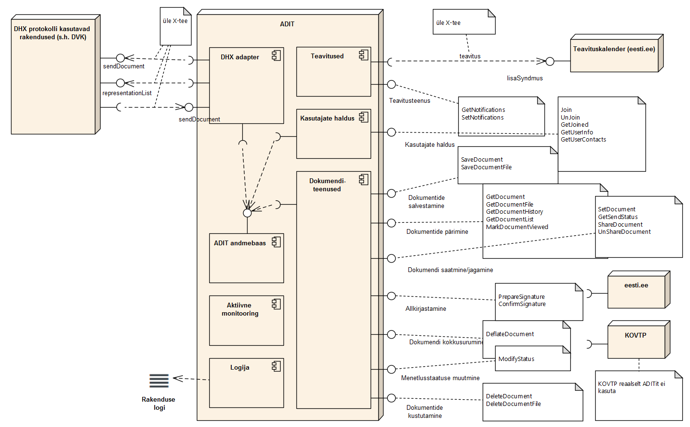

# ADIT - Lahenduse kirjeldus

## Sisukord

- [Sissejuhatus](#sissejuhatus)
- [Kasutatud tehnoloogiad](#kasutatud-tehnoloogiad)
- [Lahenduse arhitektuur ja ülesehitus](#lahenduse-arhitektuur-ja-ülesehitus)
   * [Seosed teiste infosüsteemidega](#seosed-teiste-infosüsteemidega)
      * [Teavituskalender ja riigiportaal](#teavituskalender-ja-riigiportaal)
      * [DVK liides](#dvk-liides)
   * [Tagasiside ja veateated](#tagasiside-ja-veateated)
   * [Logimine](#logimine)
      * [Rakenduse logi](#rakenduse-logi)
      * [Andmebaasi logi](#andmebaasi-logi)
   * [Arhitektuur](#arhitektuur)
- [Monitooring](#monitooring)
   * [Aktiivne monitooring](#aktiivne-monitooring)
   * [Passiivne monitooring](#passiivne-monitooring)
   
## Sissejuhatus

ADIT (Ametlike Dokumentide Infrastruktuuri Teenus) on infosüsteem, mille abil avaliku sektori infoüsteemid saavad vahetada dokumente ning hoida nende menetlusinfot. ADIT-iga suhtlemiseks kasutavad teised infosüsteemid veebiteenuseid. ADIT-il puudub kasutajaliides kuna ta on mõeldud puhtal kujul teenusena, mille peale erinevad portaalid saavad ise ehitada kasutajaliidese.

## Kasutatud tehnoloogiad

ADIT rakendus on oma olemuselt veebirakendus, mis töötab Java rakendusserveris ning publitseerib erinevaid veebiteenuseid, mille abil saab süsteemi talletada dokumente ning neid teistele kasutajatele saata. Samuti käib veebiteenuste abil kasutajakontode haldamine – kasutajakonto loomine, muutmine ja kustutamine. ADIT teenused on mõeldud kasutamiseks üle X-tee – s.t. ADIT rakendus eeldab, et veebiteenuse päringu juures on määratud X-tee päised. Järgneb ADIT lahenduse loomise juures kasutatud tehnoloogiate ja raamistike tutvustus.

- **Spring Web Services** – lahenduse kokkupanemiseks ja veebiteenuste loomiseks (http://projects.spring.io/spring-ws/)
- **X-tee teek** – Spring Web Services teegiga ühilduv X-tee spetsiifiline abiteek, mis võimaldab tarbida ja publitseerida X-tee nõuetele vastavaid veebiteenuseid (https://github.com/nortal/j-road)
- **DVK-API** – DVK universaalkliendiga suhtlemise lihtsustamiseks mõeldud Java teek (https://github.com/e-gov/DVK/tree/master/api)
- **Castor** – XML marshaller, mis võimaldab lihtsalt teisendada XML-i Java objektideks ja vastupidi (https://castor-data-binding.github.io/castor/)
- **Hibernate ORM** – andmebaasiliidese loomiseks ja andmebaasiobjektide teisendamiseks Java objektideks (http://hibernate.org/orm/)
- **JDigiDoc** – digitaalallkirjastamise abiteek. Teek pakub funktsionaalsust digitaalselt allkirjastatud failide loomiseks, lugemiseks, allkirjastamiseks
- **Log4J** – rakenduse töö ja vigade logimist lihtsustav teek (http://logging.apache.org/log4j/)
- **Quartz** – ajatatud toimingute käivitamise abiteek. Võimaldab perioodiliselt käivitada erinevaid protsesse (http://www.quartz-scheduler.org/)
- **Maven** – rakenduse ehitamiseks ja sõltuvuste (Java teegid) haldamiseks mõeldud abitarkvara (http://maven.apache.org/)

## Lahenduse arhitektuur ja ülesehitus

### Seosed teiste infosüsteemidega

ADIT on liidestatud teavituskalendri ning DVK-ga.



### Teavituskalender ja riigiportaal

ADIT rakendus on üle X-tee seotud teavituskalendriga, mille abil saadetakse kasutajatele neile huvi pakkuvaid ADIT sündmuseid, mis on järgmised:

1. Dokumendi saatmine
2. Dokumendi jagamine ja jagamise lõpetamine
3. Dokumendi vaatamine
4. Dokumendi muutmine
5. Dokumendi allkirjastamine

#### Teavituste saatmine teavituskalendrisse

ADIT kasutab teavituste saatmiseks teavituskalendrile veebiteenust „lisaSyndmus.v1“. Teavitusi saadetakse kasutajatele, kellel on ADIT teenuses vastavat liiki teavituste (näiteks teavitused allkirjastamise kohta) edastamine aktiveeritud.
ADIT lisab üldjuhul teavituskalendrisse teavituse niipea, kui vastav sündmus ADIT-is toimub. Lisaks toimub perioodilidelt selliste teavituste lisamine teavituskalendrisse, mida reaalajas ei õnnestunud mingil põhjusel lisada.

#### Teavituste staatuse pärimine riigiportaalist

ADIT andmekogu päring getNotifications tagastab oma vastuses andmeid kahest andmekogust – ADIT-ist ja riigiportaalist. S.t. getNotifications pöördub taustal riigiportaali andmekogu poole ja pärib sealt „tellimusteStaatus.v1“ päringuga, millised teavitused on antud kasutajal tellitud ja millistele e-posti aadressidele need suunatakse.


### DVK liides

ADIT rakendus kasutab dokumentide edastamisel ühe kanalina DVK tarkvara. Dokumendid liiguvad ADIT ja DVK vahel mõlemas suunas, mis tähendab, et ka dokumentide staatuste muudatusi on vaja mõlemapidiselt edastada.

ADIT kasutab DVK universaalkliendi andmebaasiga suhtlemiseks DVK API-t, mis on spetsiaalselt selleks otstarbeks loodud Java teek. DVK API kasutamiseks tuleb API juures seadistada DVK universaalkliendi andmebaasi ühenduse parameetrid. 

ADIT-i vajadus on saata juhtudel, kui saaja üks asutustest on DVK kasutaja, dokumente talle läbi DVK teenuse. Sellisel juhul on vaja teada ka kõiki dokumendi staatuse muudatusi, mis toimuvad DVK-s.

ADIT peab olema suuteline ka DVK-st tulevaid dokumente vastu võtma ning oma andmetabelitesse paigutama. Sellisel juhul on oluline, et kui dokumendi staatus muutub ADIT-is, kanduks see staatuse muudatus ka DVK-sse.


#### Dokumendi saatmine DVK-le

Kui ADIT rakendusest saadetakse dokument (kutsutakse välja veebiteenus „sendDocument()“) adressaadile, siis saatmisele eelnevalt kontrollitakse, kas adressaat on liitunud DVK-ga. Kui vastus on positiivne, saadetaksegi dokument sellele konkreetsele adressaadile DVK kaudu. 
See tähendab seda, et saadetava dokumendi andmete põhjal koostatakse DVK versioon 2.1 konteiner (vastavad meetodid on olemas DVK API-s). Seejärel lisatakse DVK konteiner koos saatmist puudutavate andmetega DVK universaalkliendi andmebaasi (jällegi on vastavad Java klassid ja abimeetodid olemas DVK API-s). Sellega loetakse dokument DVK-le edastatuks ning vastav märge tehakse ka ADIT andmebaasi. 

Universaalklient saadab vastavalt seadistatud ajale dokumendid DVKsse. Peale seda, kui dokument on DVK universaalkliendist saadetud DVK serverisse, kustutatakse dokumendi sisu DVK universaalkliendi andmebaasist (kasutades DVK API-t). See on vajalik selleks, et hoida kokku DVK universaalkliendi andmebaasi mahtu. Samamoodi toimitakse juhul kui dokument liigub vastupidises suunas – DVK -> ADIT (peale dokumendi edukat salvestamist ADIT andmebaasi, kustutatakse andmed DVK universaalkliendi andmebaasist).

#### Dokumendi staatuse uuendamine DVK-st

Kui dokument on DVK-sse saadetud on vajalik saada tagasisidet selle kohta, kas dokument on adressaadini jõudnud või kui dokument on adressaadini jõudnud, siis kas dokument on töötlemisel jne. Ehk meid huvitab, milline staatus on dokumendil DVK-s. 
Selleks peame perioodiliselt kontrollima, mis staatuses dokument DVK universaalkliendi andmebaasis on. Sellise kontrolli jaoks luuakse eraldi ajatatud protsess, mis seadistuses määratud perioodi tagant kontrollib DVK-sse saadetud dokumentide staatuseid. Staatuste kontrollimiseks kasutatakse DVK API-s olevat vastavat funktsionaalsust. Kontrollimiseks luuakse kaks eraldiseisvat protsessi. 

Esimene neist kontrollib ainult nende dokumentide staatuseid, mis ei ole veel kättesaaduks märgitud. Teine protsess kontrollib kõikide ülejäänud dokumentide staatuseid. Mõlemate protsesside käivitamise periood on eraldi seadistatav. Kui kontrollimise käigus leitakse dokumente, mille staatus on muutunud võrreldes nende staatusega ADIT andmebaasis, siis uuendatakse vastavad kirjed ADIT andmebaasis. Sellega loetakse dokumendi staatus uuendatuks.

#### Dokumendi vastuvõtmine DVK-st

Juhul kui dokument saadetakse läbi DVK ADIT-sse, tuleb DVK universaalkliendi andmebaasis oleva DVK konteineri andmed ADIT jaoks arusaadavaks teha. Selleks on mõistlik kasutada DVK API-t, milles on vastavad Java klassid. 

Niisiis saabunud DVK konteinerist võetakse välja andmed ning salvestatakse ADIT andmebaasis. ADIT andmebaasis seotakse dokument dokumendi adressaadiks olnud kasutajaga. Peale edukat sidumist kustutatakse universaalkliendi andmebaasist vastava dokumendi sisu. Saabunud dokumente kontrollitakse eraldi käivitatava protsessi abil, mille periood ning käivitamise aeg on seadistatav.
Kui dokumendi sidumisel kasutajaga ilmnes, et kasutajat pole ADIT aktiivsete kasutajate hulgas, siis märgitakse dokument DVKs katkestatuks (staatus 103) ning algsele saatjale koostatakse automaatselt vastuskiri, milles on toodud kaaskirja dokument (muudetav ADIT haldaja poolt) ning algne dokument. Kui dokumendi adressaadiks on DVK kasutaja, siis talitatakse sarnaselt eeltoodule, kuna DVK kasutajad peavad suhtlema otse omavahel, mitte ADIT kaudu.

DVK kaudu vastuvõetava dokumendi puhul on vaja välja selgitada, millisele ADIT kasutajale see dokument mõeldud on. Selle jaoks tuleb panna ADIT kasutaja kood DVK konteineris transport ning saaja blokki – täpsemalt `<Transport><DecRecipient><PersonalIdCode>` ning `<Recipient><Person><PersonalIdCode>` sisse:

```xml
<DecContainer xmlns="http://www.riik.ee/schemas/deccontainer/vers_2_1/">
    <Transport>
		...
        <DecRecipient>
            <OrganisationCode>adit</OrganisationCode>
            <PersonalIdCode>EE47101010033</PersonalIdCode>
        </DecRecipient>
        ...
    </Transport>
    ...
    <Recipient>
		...
        <Person>
        	<Name>Mari-Liis Männik</Name>
         	<GivenName>Mari-Liis</GivenName>
        	<Surname>Männik</Surname>
         	<PersonalIdCode>EE47101010033</PersonalIdCode>
          	<Residency>EE</Residency>
        </Person>
    	...
    </Recipient>
```

#### Dokumendi staatuse uuendamine DVK-s

Kui dokument on läbi DVK ADIT-sse saadetud, osutub vajalikuks anda tagasisidet saatjale. Selleks peab ADIT uuendama dokumendi staatust DVK universaalkliendi andmebaasis juhul kui see on muutunud ADIT andmebaasis. Seega, kui ADIT andmebaasis toimub dokumendi staatuse uuendamine (ADIT päring „modifyStatus“), muudetakse staatus koheselt ka DVK universaalkliendi andmebaasis. Selleks kasutatakse jällegi DVK API-t, milles sisalduvate klasside abil võetakse DVK universaalkliendi andmebaasist välja dokumendi kirje ning muudetakse selle staatust.

#### DVK kasutajate eristamine

DVK kasutajad eristatakse ADIT kasutajatest selle poolest, et DVK kasutajate kontol on määratud DVK organisatsiooni registrikood (tabel ADIT_USER.dvk_org_code). Kui see andmetabeli väli ei ole määratud on tegemist nö. ADIT tavakasutajaga.
DVK kasutaja andmete muudatused (lisamised, nimemuutused, kustutamised) tulevad ainult ühepoolselt – DVK serverist ADITisse. DVK kasutajate andmeid ei saa muuta join või unJoin päringutega.
DVK kasutaja (pöördudes ADIT teenuse poole otseste x-tee päringutega)  saab kutsuda välja ainult päringuid:

- getDocumentList
- getDocument (ainukese erinevusega ei märgita selle puhul dokumenti „vaadatuks“, vaid seda teeb DVK liides, kes tagastab õige DVK staatuse)
- getDocumentFile
- getDocumentHistory

#### DVK kasutajate sünkroniseerimine

Kõik DVK kasutajad on automaatselt ka ADIT kasutajad. See tähendab seda, et ADIT rakenduse paigaldamisel on vaja tekitada ADIT-isse kõikidele DVK kasutajatele vastavad kasutajakontod. Samuti on vaja seadistuses määratud perioodi tagant kontrollida üle, kas DVK kasutajate ja ADIT kasutajate vahel on erinevusi. Selleks on ette nähtud ajatatud ajatatud toiming, mida saab seadistada perioodiliselt käivituma ja mis teeb järgmist:

- Eemaldab DVK-st kustutatud kasutajate andmed ADIT andmebaasist (märgib kasutajate kontod mitteaktiivseks)
- Uuendab muutunud kasutajate andmed (kasutaja registrikoodi põhiselt)
- Loob lisandunud DVK kasutajate jaoks ADIT kasutajakontod

### Tagasiside ja veateated

Tagasiside andmiseks teenuse tarbijatele tagastatakse SOAP päringu vastuses vastavalt päringu õnnestumisele (vea)teade. Teated pannakse SOAP päringu vastuse kehas asuvasse elementi `<messages>`. Päringu üldist õnnestumist / ebaõnnestumist näitab elemendi `<success>` väärtus (kui see on „true“, siis päring õnnestus täielikult).  Kui päringu täitmisel ilmnes ootamatu viga, mille töötlemisega ei ole arvestatud, siis tagastatakse veateade „Service Error“ – sellisel juhul tuleb vaadata rakenduse logidest, mis vea põhjustas.

Näide päringu vastuses olevast veateatest:

```xml
<adit:success>true/false</adit:success>
<adit:messages>
<adit:message lang="en">[teade]</adit:message>
    <adit:message lang="et">[teade]</adit:message>
    …
</adit:messages>
```

Veateadete sisu on määratud erinevates seadistusfailides , millest iga fail kirjeldab teated mingis kindlas keeles. Seadistusfailide nimekuju on järgmine: „messages_[LANGUAGE_CODE].properties“, kus [LANGUAGE_CODE] määrab ära millise keelega on tegemist. Inglisekeelsed teated asuvad failis nimega „messages_en.properties“.

Teated on määratud järgmises võti-väärtus formaadis:

```
...
user.nonExistent = User does not exist: {0}
user.inactive User account deleted (inactive) for user {0}
document.nonExistent = Document does not exist. Document ID: {0}
...
```

### Logimine

ADIT rakenduse puhul rakendatakse kahte tüüpi logimist – rakenduse logi ning logimine andmebaasis.

#### Rakenduse logi

Rakenduse logi tekitamiseks kasutatakse Log4j teeki, mis võimaldab logimise seadistust muuta konfiguratsioonifaili abil. Vaikimisi logitakse eraldi failidesse DVK liidese logi ning ADIT rakenduse logi.

#### Andmebaasi logi

Järgenvalt on toodud erinevad ADIT andmebaasis olevad logitabelid ning nende eesmärk:

- **ADIT_LOG** – hoiab andmeid kõikide andmebaasis toimunud muudatuste kohta.
- **REQUEST_LOG** - tehtud päringute logimiseks. Logitakse järgmised päringud:
   * saveDocument
   * saveDocumentFile
   * deleteDocumentFile
   * archieveDocument
   * deleteDocument
   * getDocumentHistory
   * sendDocument
   * shareDocument
   * unShareDocument
   * markDocumentViewed
   * prepareSignature
   * confirmSignature
   * modifyStatus
- **METADATA_REQUEST_LOG** – logitakse järgmised päringud:
   * getDocumentList
   * getDocument
- **DOWNLOAD_REQUEST_LOG** – logitakse järgmised päringud:
   * getDocument (juhul kui päringu parameetri „kas tagastada ka failide sisu“ väärtuseks on „jah“)
   * getDocumentFile
- **ERROR_LOG** – logitakse päringute käigus tekkinud veateated

### Arhitektuur

ADIT rakenduse ülesehituse defineerib Spring Context Configuration, mis on sisuliselt XML konfiguratsioonifail, mis näitab Spring raamistikule, kuidas on erinevad klassid omavahel seotud ning millised on nende klasside omadused. Selleks failiks on antud juhul adit-servlet.xml
Veebiteenuste nö. sisenemispunktiks on Spring Web Services juures alati „Endpoint“. See on punkt, kust algab veebiteenuse päringu töötlemine. Erinevate rakenduse kihtide vahelised seosed on samuti defineeritud selles samas XML failis. Rakenduse kihid on järgmised:

**Andmekiht** (_Data Layer_) – andmebaasikihi moodustavad _DAO (Data Access Object)_ klassid, mis asuvad koodipuus paketis „ee.adit.dao“. Andmebaasikiht defineerib meetodid, mille abil suheldakse andmebaasiga. Kuna ADIT puhul leidus ka keerulisemaid äriloogilisi funktsioone, mille puhul ei olnud võimalik paigutada kogu andmebaasisuhtlust _DAO_ klassidesse, siis mõnel juhul võib leida andmebaasisuhtluseks mõeldud meetodeid ka teenuskihist. _DAO_ klassid kasutavad andmebaasiobjektidega suhtlemiseks _POJO (Plain Old Java Object)_ stiilis klasse, mis on _Hibernate mapping_ abil seotud andmebaasiobjektidega. Andmebaasisuhtluseks kasutatav _sessionFactory_ defineeritakse koos informatsiooniga selle kohta, kuidas Java klassid on seotud andmetabelitega järgmiselt:

```xml
<bean id="sessionFactory"
class="org.springframework.orm.hibernate3.LocalSessionFactoryBean">
  ...
  <property name="mappingLocations">
    <list>
      <value>classpath:hbm/AccessRestriction.hbm.xml</value>
      <value>classpath:hbm/AditUser.hbm.xml</value>
      <value>classpath:hbm/Document.hbm.xml</value>
      <value>classpath:hbm/DocumentDvkStatus.hbm.xml</value>
      <value>classpath:hbm/DocumentFile.hbm.xml</value>
      <value>classpath:hbm/DocumentFileDeflateResult.hbm.xml</value>
      <value>classpath:hbm/DocumentHistory.hbm.xml</value>
      <value>classpath:hbm/DocumentHistoryType.hbm.xml</value>
      <value>classpath:hbm/DocumentSharing.hbm.xml</value>
      <value>classpath:hbm/DocumentSharingType.hbm.xml</value>
      <value>classpath:hbm/DocumentType.hbm.xml</value>
      <value>classpath:hbm/DocumentWfStatus.hbm.xml</value>
      <value>classpath:hbm/Notification.hbm.xml</value>
      <value>classpath:hbm/NotificationType.hbm.xml</value>
<value>classpath:hbm/RemoteApplication.hbm.xml</value>
<value>classpath:hbm/RequestLog.hbm.xml</value>
<value>classpath:hbm/Signature.hbm.xml</value>
<value>classpath:hbm/UserNotification.hbm.xml</value>
<value>classpath:hbm/Usertype.hbm.xml</value>
    </list>
  </property>
  ...
</bean>
```

**Äriloogika kiht** (_Business Logic Layer_) – äriloogika kihi moodustavad teenusklassid e. _Service_ klassid. Nendes klassides on implementeeritud meetodid, mis sisaldavad äriloogika reegleid. Teenusklassid suhtlevad andmetega manipuleerimiseks _DAO_ klassidega.

**Presentatsiooni kiht** (_Presentation Layer_) – nö rakenduse kasutajaliides kiht, milleks antud juhul on veebiteenused. Presentatsiooni kihi moodustavad Endpoint klassid, mis asuvad paketis „ee.adit.ws.endpoint“ ning implementeerivad SOAP veebiteenuste jaoks vajalikud meetodid. Presentatsiooni kihi klassid kutsuvad välja äriloogika kihi meetodeid ning väldivad suhtlemist otse andmekihiga. Antud lahenduse juures on presentatsiooni kihis seadistatud ka _Castor XML Marshaller_ , mis võimaldab automaatselt teisendada sissetuleva/väljamineva _XML_ stringi _Java_ objektiks, mida on seejärel mugav manipuleerida. _Endpoint_ saab päringu töötlemiseks nn. _request_ objekti ning tagastab nn. _response_ objekti.

## Monitooring

ADIT rakenduse monitooring koosneb aktiivsest ja passiivsest monitooringust. Aktiivseks rakenduse monitoorimiseks on mõeldud monitooringu servlet, mis paigaldatakse koos rakendusega. Passiivse monitooringu lahendab Log4J Nagios appender – rakendus logib tekkinud vead kindlas formaadis kindlasse väljundisse. Nagiose seadistamisest on täpsemalt juttu paigaldusjuhendis.

### Aktiivne monitooring

Aktiivse monitooringu eesmärgiks on kontrollida rakenduse olulisemate komponentide töötamist. Kontrollitakse järgmiseid päringuid ja komponente:

| IDENTIFITSEERIV STRING | Päring / komponent |
| --- | --- |
| SAVE_DOCUMENT | Päringu saveDocument kontroll – muudetakse andmebaasis olevat testdokumenti (dokumendi pealkiri ja dokumendi faili sisu muudetakse – päringu tegemise hetke kuupäev / kellaaeg) |
| GET_DOCUMENT | Päringu getDocument kontroll – päritakse testdokumendi andmed ning kontrollitakse, kas dokumendi sisu on viimase saveDocument päringuga muudetud. |
| DVK_SEND | DVK-sse saatmise kontroll – kontrollitakse, kas andmebaasis on dokumente, mis on määratud DVK-sse saatmisele, kuid mille saatmine sinna ei ole õnnestunud määratud perioodi vältel. |
| DVK_RECEIVE | DVK-st dokumentide vastuvõtmise kontroll – kontrollitakse, kas dokumendid, mis on saabunud DVK Universaalklienti, on kantud ka ADIT andmebaasi. |
| GET_USER_INFO | Päringu getUserInfo kontroll – kontrollitakse, kas testkasutaja on teenusega liitunud ning kas päring tagastab kasutaja andmed. |
| NOTIFICATIONS | Teavitusteenuse liidese kontroll – kontrollitakse, kas andmebaasis on teavitusi, mis ei ole määratud perioodi jooksul saadetud teavitusteenusele. |
| ERROR_LOG | Vigade logitabeli kontroll – kontrollitakse, kas andmebaasis olevasse vigade tabelisse on tekkinud vigu.  Vaadeldavate vigade taseme (WARN/ERROR/FATAL) saab määrata seadistuses. |
| SUMMARY_STATUS | Näitab rakenduse töötamise koondstaatust – arvestatakse kõikide komponentide staatuseid v.a. ERROR_LOG. Kui üks komponentidest ei tööta, siis saab koondstaatuse väärtuseks „FAIL“ (ei tööta). |

ADIT rakenduse monitooringu servlet asub aadressil http://[host]:[port]/adit/monitor. Monitooringurakenduse seadistamiseks on failis **adit-configuration.xml** vastav sektsioon (lähemalt vaata paigaldusjuhendist).

### Passiivne monitooring

Passiivne monitooring saadab teateid Log4J appender-i abil. Teated on järgmises formaadis:

[KOMPONENT] [STATUS] [TIME/ERROR_MESSAGE]

Nt. õnnestumisel „ADIT_UK_CONNECTION_READ OK 0.008 seconds“ või ebaõnnestumisel „ADIT_UK_CONNECTION FAIL ORA-12345: Could not connect to host uk.ria.ee”

Komponendid, mille kohta teateid saadetakse on järgmised:

| Komponent | Kirjeldus |
| --- | --- |
| ADIT_APP | Kontrollib rakenduse seadistust ja üldist töötamist. |
| ADIT_DB_CONNECTION | Kontrollib andmebaasiühendust |
| ADIT_DB_CONNECTION_READ | Kontrollib andmete lugemist andmebaasist |
| ADIT_DB_CONNECTION_WRITE | Kontrollib andmete kirjutamist andmebaasi |
| ADIT_UK_CONNECTION | Kontrollib ADIT DVK universaalkliendi andmebaasiühendust |
| ADIT_UK_CONNECTION_READ | Kontrollib ADIT DVK universaalkliendi andmebaasist andmete lugemist |
| ADIT_UK_CONNECTION_WRITE | Kontrollib ADIT DVK universaalkliendi andmebaasi andmete kirjutamist |

